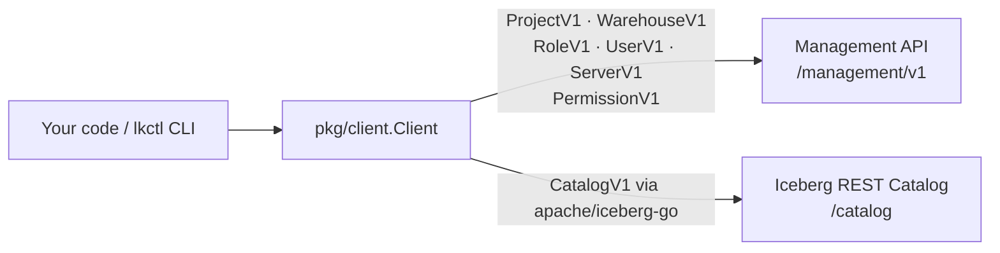

# Lakekeeper Go Client

[](https://goreportcard.com/report/github.com/lakekeeper/go-lakekeeper)
[](https://godoc.org/github.com/lakekeeper/go-lakekeeper)
[](https://github.com/lakekeeper/go-lakekeeper/actions/workflows/test.yml)
[](https://github.com/lakekeeper/go-lakekeeper/actions/workflows/nightly.yml)

Go Client for [Lakekeeper API](https://docs.lakekeeper.io).

It provides a convenient way to interact with Lakekeeper services from your Go applications (And a new CLI tool in preview).



## Documentation

- [Architecture](docs/ARCHITECTURE.md) — component overview, request lifecycle, bootstrap flow
- [Package Reference](docs/PACKAGES.md) — every `pkg/` package, its types, and dependency graph
- [Authentication](docs/AUTHENTICATION.md) — `OAuthTokenSource`, `AccessTokenAuthSource`, `K8sServiceAccountAuthSource` with sequence diagrams
- [CLI Reference](docs/CLI.md) — `lkctl` command tree, environment variables, examples

## Table of Contents

- [Lakekeeper Go Client](#lakekeeper-go-client)
  - [Table of Contents](#table-of-contents)
  - [Documentation](#documentation)
  - [CLI Usage](#cli-usage)
    - [Installation](#installation)
    - [Authentication](#authentication)
    - [Bootstrapping](#bootstrapping)
    - [Some Examples](#some-examples)
  - [Go Package Usage](#go-package-usage)
    - [Installation](#installation-1)
    - [Client Initialization](#client-initialization)
      - [Client Credentials (OIDC)](#client-credentials-oidc)
      - [Kubernetes Service Account](#kubernetes-service-account)
    - [Management API](#management-api)
      - [Server Information](#server-information)
      - [Projects](#projects)
      - [Project-Scoped Resources (e.g., Roles, Warehouses)](#project-scoped-resources-eg-roles-warehouses)
      - [Create resources (e.g., Warehouse)](#create-resources-eg-warehouse)
    - [Catalog API (Iceberg REST Catalog)](#catalog-api-iceberg-rest-catalog)
      - [Getting a REST Catalog interface](#getting-a-rest-catalog-interface)


## CLI Usage

### Installation

You can directly download the binaries on [Releases page](https://github.com/lakekeeper/go-lakekeeper/releases/latest).

A docker image is also available

```sh
docker run --rm quay.io/lakekeeper/lkctl version
```

### Authentication

You can authenticate to Lakekeeper using the CLI with both `flags` or `env` variables.

Eg. with flags:

```sh
lkctl info \
    --server http://localhost:8181 \
    --auth-url http://localhost:30080/realms/iceberg/protocol/openid-connect/token \
    --client-id spark \
    --client-secret 2OR3eRvYfSZzzZ16MlPd95jhLnOaLM \
    --scope lakekeeper
```

Eg. with environment variables:

```sh
export LAKEKEEPER_SERVER=http://localhost:8181
export LAKEKEEPER_AUTH_URL=http://localhost:30080/realms/iceberg/protocol/openid-connect/token
export LAKEKEEPER_CLIENT_ID=spark
export LAKEKEEPER_CLIENT_SECRET=2OR3eRvYfSZzzZ16MlPd95jhLnOaLM
export LAKEKEEPER_SCOPE=lakekeeper

lkctl info
```

You can also set these variables in a `.env` file.

### Bootstrapping

A flag is available to bootstrap the server before executing other commands. **The current user will have the operator role**

```sh
lkctl project ls --bootstrap
```

If you rather want to bootstrap the server with the appropriate command

```sh
lkctl server bootstrap --accept-terms-of-use --as-operator
```

### Some Examples

Create a project and a role

```sh
PROJECT_ID=$(lkctl project add new-project | jq -r .)
lkctl role add --project $PROJECT_ID new-role --description "This is a new role"
```

Assign a role to a user

```sh
lkctl role assign $ROLE_ID --user $USER_ID --assignment assignee
```

Delete a project

```sh
lkctl project rm $PROJECT_ID
```

## Go Package Usage

The client is organized into services that correspond to different parts of the Lakekeeper API.

The two main parts are [Management](#management-api) and [Catalog](#catalog-api-iceberg-rest-catalog).

The Catalog part is handled by the Iceberg Go implementation : [go-iceberg](https://github.com/apache/iceberg-go).

### Installation

To install the client library, use `go get`:

```sh
go get github.com/lakekeeper/go-lakekeeper
```

This library requires Go 1.24 or later.

### Client Initialization

First, import the client package.
Then, create a new client using your authentication configurations and the base URL of your Lakekeeper instance.

If you're using the [Lakekeeper Examples](https://github.com/lakekeeper/lakekeeper/tree/main/examples), then you can create the client as follow:

#### Client Credentials (OIDC)

```go
import (
    "log"

    "golang.org/x/oauth2/clientcredentials"

    "github.com/lakekeeper/go-lakekeeper/pkg/core"
    lakekeeper "github.com/lakekeeper/go-lakekeeper/pkg/client"
    managementv1 "github.com/lakekeeper/go-lakekeeper/pkg/apis/management/v1"
)

func main() {
    // Create the OAuth configuration
    oauthConfig := &clientcredentials.Config{
        ClientID:     "spark",
        ClientSecret: "2OR3eRvYfSZzzZ16MlPd95jhLnOaLM52",
        TokenURL:     "http://localhost:30080/realms/iceberg/protocol/openid-connect/token",
        Scopes:       []string{"lakekeeper"},
    }

    as := core.OAuthTokenSource{TokenSource: oauthConfig.TokenSource()}
    
    // Create the client and enable the initial bootstrap
    client, err := lakekeeper.NewAuthSourceClient(
        context.Background(),
        &as,
        baseURL,
        lakekeeper.WithInitialBootstrapV1Enabled(true, true, core.Ptr(managementv1.ApplicationUserType))
    )
    if err != nil {
        log.Fatalf("error creating lakekeeper client, %v", err)
    }

    // You can now use the client to interact with the API
    project, err := client.ProjectV1().Create(...)
}
```

#### Kubernetes Service Account

```go
// This gets the service account token 
// usually stored in /var/run/secrets/kubernetes.io/serviceaccount/token
client, err := lakekeeper.NewAuthSourceClient(ctx, &core.K8sServiceAccountAuthSource{}, baseURL)
if err != nil {
    log.Fatalf("error creating lakekeeper client, %v", err)
}
```

### Management API

#### Server Information

You can get information about the Lakekeeper server instance:

```go
serverInfo, _, err := client.ServerV1().Info(ctx)
if err != nil {
    log.Fatalf("Failed to get server info: %v", err)
}

log.Printf("Connected to Lakekeeper version, %s\n", serverInfo.Version)
```

#### Projects

```go
// Get default project
project, _, err := client.ProjectV1().GetDefault(ctx)
if err != nil {
    log.Fatalf("Failed to get project: %v", err)
}

// Get Project By ID
project, _, err := client.ProjectV1().Get(ctx, projectID)
if err != nil {
    log.Fatalf("Failed to get project %s, %v", projectID, err)
}
```

#### Project-Scoped Resources (e.g., Roles, Warehouses)

Services for resources like Roles and Warehouses are scoped to a specific project.
You first create a service for that project ID.

```go
// Get a specific role within a project
role, _, err := client.RoleV1(project.ID).Get(ctx, "a-role-id")
if err != nil {
    return err
}

// Get a warehouse within a project
warehouse, _, err := client.WarehouseV1(project.ID).Get(ctx, "a-warehouse-id")
if err != nil {
    return err
}
```

#### Create resources (e.g., Warehouse)

```go
// Set the storage settings (eg. MinIO)
storage, _ := profilev1.NewS3StorageSettings("bucket-name", "local-01",
    profilev1.WithEndpoint("http://minio:9000/"),
    profilev1.WithPathStyleAccess()
)

creds, _ := credentialv1.NewS3CredentialAccessKey("access-key-id", "secret-access-key")

opts := managementv1.CreateWarehouseOptions{
    Name:              "my-warehouse",
    StorageProfile:    storage.AsProfile(),
    StorageCredential: creds.AsCredential(),
    DeleteProfile:     profilev1.NewTabularDeleteProfileHard().AsProfile(),
}

// Create the warehouse
warehouse, _, err := client.WarehouseV1(project.ID).Create(ctx, &opts)
if err != nil {
    return err
}

fmt.Printf("Warehouse with ID %s created!\n", warehouse.ID)
```


### Catalog API (Iceberg REST Catalog)

#### Getting a REST Catalog interface

```go
catalog, err := client.Catalog(ctx, projectID, warehouseName)
if err != nil {
    log.Fatalf("Failed to get REST catalog for warehouse %s in project %s, %v", warehouseName, projectID, err)
}

// catalog is a *rest.Catalog, you can use it to interact with the Iceberg REST catalog API.
```
