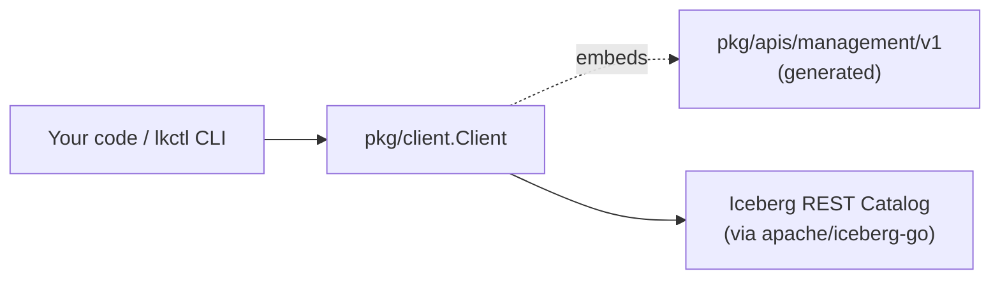

# Lakekeeper Go Client

[](https://goreportcard.com/report/github.com/lakekeeper/go-lakekeeper)
[](https://godoc.org/github.com/lakekeeper/go-lakekeeper)
[](https://github.com/lakekeeper/go-lakekeeper/actions/workflows/test.yml)
[](https://github.com/lakekeeper/go-lakekeeper/actions/workflows/nightly.yml)

Go SDK and `lkctl` CLI for the [Lakekeeper](https://docs.lakekeeper.io)
Iceberg catalog. The Management API client is generated from Lakekeeper's
OpenAPI spec; everything else — auth, retries, the CLI, ergonomic builders
for storage profiles and permissions — is hand-written.



## Documentation

- [Architecture](docs/ARCHITECTURE.md) — component overview, request lifecycle, bootstrap flow
- [Package Reference](docs/PACKAGES.md) — every `pkg/` package, including `pkg/core` auth (`OAuthTokenSource`, `AccessTokenAuthSource`, `K8sServiceAccountAuthSource`)
- [Generated client](docs/GENERATION.md) — what's generated, how to regenerate, why a YAML preprocessor is involved
- [CLI Reference](docs/CLI.md) — `lkctl` command tree, environment variables, examples

## Compatibility

The Management API client is generated from Lakekeeper's OpenAPI spec, so
each client release is pinned to a minimum Lakekeeper version that the
integration suite exercises end-to-end. Newer Lakekeeper releases on the
same major/minor line are expected to remain compatible; mixing a client
with an older Lakekeeper than the row below is unsupported.

<!-- BEGIN compatibility-matrix -->
| Client version | Minimum Lakekeeper version |
| -------------- | -------------------------- |
| `0.1.x`        | `v0.12.0`                  |
<!-- END compatibility-matrix -->

The minimum version is the lowest entry in the `lakekeeper_version` matrix
of [`.github/workflows/test.yml`](.github/workflows/test.yml).

## Quick start — CLI

Pre-built binaries on the [Releases page](https://github.com/lakekeeper/go-lakekeeper/releases/latest),
or via Docker:

```sh
docker run --rm quay.io/lakekeeper/lkctl version
```

Authenticate via flags or environment variables (`.env` files are loaded
automatically):

```sh
export LAKEKEEPER_SERVER=http://localhost:8181
export LAKEKEEPER_AUTH_URL=http://localhost:30080/realms/iceberg/protocol/openid-connect/token
export LAKEKEEPER_CLIENT_ID=<your-client-id>
export LAKEKEEPER_CLIENT_SECRET=<your-client-secret>
export LAKEKEEPER_SCOPE=lakekeeper

lkctl server bootstrap --accept-terms-of-use --as-operator
PROJECT_ID=$(lkctl project create new-project | jq -r .)
lkctl role create "new-role" --project $PROJECT_ID --description "A new role"
```

See [docs/CLI.md](docs/CLI.md) for the full command reference.

## Quick start — Go SDK

```sh
go get github.com/lakekeeper/go-lakekeeper
```

Requires Go 1.24+.

```go
package main

import (
    "context"
    "log"

    "golang.org/x/oauth2/clientcredentials"

    managementv1 "github.com/lakekeeper/go-lakekeeper/pkg/apis/management/v1"
    "github.com/lakekeeper/go-lakekeeper/pkg/client"
    "github.com/lakekeeper/go-lakekeeper/pkg/core"
)

func main() {
    ctx := context.Background()

    cfg := &clientcredentials.Config{
        ClientID:     "<your-client-id>",
        ClientSecret: "<your-client-secret>",
        TokenURL:     "http://localhost:30080/realms/iceberg/protocol/openid-connect/token",
        Scopes:       []string{"lakekeeper"},
    }

    as := &core.OAuthTokenSource{TokenSource: cfg.TokenSource(ctx)}
    c, err := client.NewWithAuthSource(ctx, "http://localhost:8181", as,
        client.WithInitialBootstrap(true, true, core.Ptr(managementv1.USERTYPE_APPLICATION)),
    )
    if err != nil {
        log.Fatalf("create client: %v", err)
    }

    info, _, err := c.ServerAPI.GetServerInfo(ctx).Execute()
    if err != nil {
        log.Fatalf("server info: %v", err)
    }
    log.Printf("connected to lakekeeper %s", info.Version)
}
```

The generated services are exposed as fields on `*client.Client`:
`c.ServerAPI`, `c.ProjectAPI`, `c.WarehouseAPI`, `c.RoleAPI`, `c.UserAPI`,
`c.PermissionsOpenfgaAPI`, etc. See
[docs/PACKAGES.md](docs/PACKAGES.md) for the full surface and
[docs/ARCHITECTURE.md](docs/ARCHITECTURE.md) for how requests flow
end-to-end.

### Catalog access

```go
catalog, err := c.CatalogV1(ctx, projectID, warehouseName)
if err != nil {
    log.Fatalf("get catalog: %v", err)
}
// catalog is *apache/iceberg-go/catalog/rest.Catalog
```
