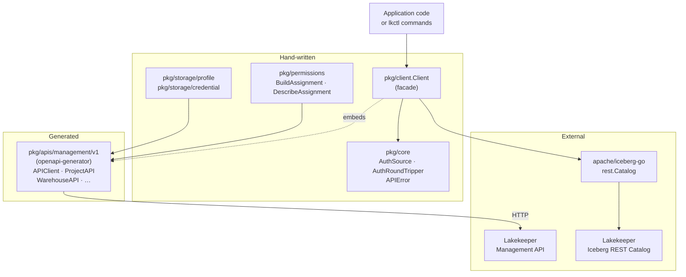
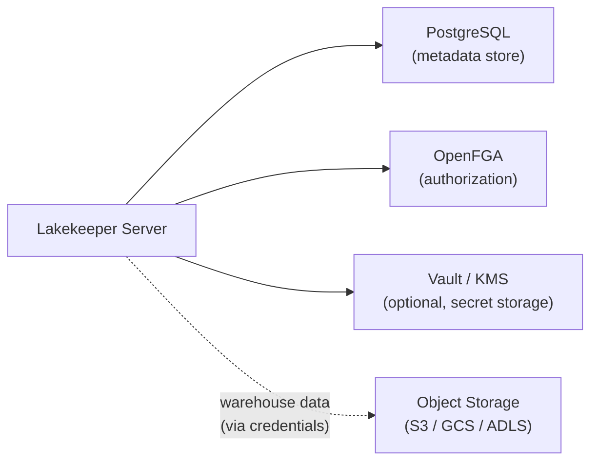
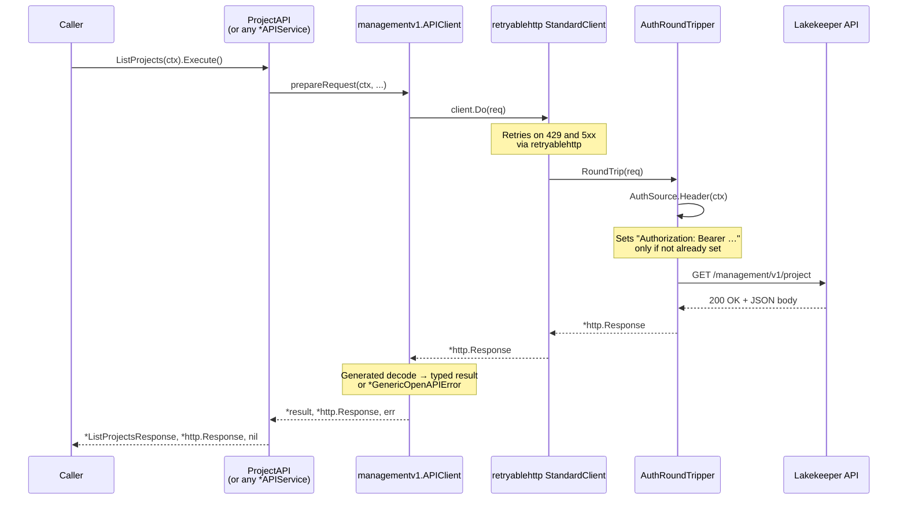

# Architecture

`go-lakekeeper` is a Go SDK and CLI (`lkctl`) for the
[Lakekeeper](https://docs.lakekeeper.io) Management and Iceberg REST
Catalog APIs. The Management API client is generated from the upstream
OpenAPI spec; everything else — the auth layer, the retry layer, the CLI,
and the ergonomic builders for storage and permissions — is hand-written.

For the generated/manual split, regeneration workflow, and the OpenAPI
preprocessor, see [GENERATION.md](GENERATION.md). For a per-package tour
of types and entry points, see [PACKAGES.md](PACKAGES.md).

## Component Overview

`pkg/client.Client` **embeds** `*managementv1.APIClient`. That means every
generated service is reachable as a public field on `Client`
(`c.ProjectAPI`, `c.WarehouseAPI`, `c.RoleAPI`, `c.UserAPI`, `c.ServerAPI`,
`c.PermissionsOpenfgaAPI`, `c.AuthorizationAPI`, `c.TasksAPI`). The facade
itself only adds:

- **Auth wiring** through `core.AuthRoundTripper`, which injects the
  `Authorization` header on every outbound request.
- **Retries** by wrapping the auth-injecting transport in
  `retryablehttp.NewClient().StandardClient()`.
- **Optional bootstrap** at construction time via `WithInitialBootstrap`.
- **`CatalogV1(ctx, projectID, warehouse, …)`** — a one-shot helper that
  delegates to `apache/iceberg-go`.

## Server-side context

`go-lakekeeper` is a **client** — it does not run any server-side
components. The Lakekeeper server itself depends on:

The integration-test stack (`make test-integration`) brings up
Lakekeeper + **Keycloak** (OIDC IdP) + **MinIO** (S3-compatible storage) +
**OpenFGA** via `docker-compose`, which is the canonical reference
environment for this SDK.

## Request Lifecycle

Every SDK call follows the same path from the generated service through
the embedded `APIClient` and out to the wire.

Key points:

- **The generated client is the only place the URL is assembled.** The
  base URL is set on the `Configuration` once at client construction
  ([`pkg/client/client.go`](../pkg/client/client.go)) and never changes
  per-request.
- **Auth is per-request.** `AuthSource.Init` runs once during
  `NewWithAuthSource`; `AuthSource.Header` is then called by
  `AuthRoundTripper` on every request. `OAuthTokenSource` defers cache
  and renewal logic to `golang.org/x/oauth2`, so token refresh is
  transparent.
- **Retries are decoupled from the generated client.** `retryablehttp`
  retries `429` and any `>= 500` status with linear-jitter backoff
  (defaults: 100 ms–400 ms, max 5 retries). Disable with `WithoutRetries()`
  or tune with `WithRetryMax`, `WithRetryWait`, `WithCheckRetry`,
  `WithBackoff`, and `WithErrorHandler`.
- **Errors come from the generator.** Non-2xx responses surface as
  `*managementv1.GenericOpenAPIError`, which carries the raw body and
  any decoded error model.

## Bootstrap Flow

When `WithInitialBootstrap(true, isOperator, userType)` is passed to
`NewWithAuthSource`, the client calls `ServerAPI.GetServerInfo` during
construction; if the server reports `bootstrapped: false`, it then calls
`ServerAPI.Bootstrap` automatically. This happens at most once per client
instance (see [`pkg/client/client.go`](../pkg/client/client.go) →
`runBootstrap`).

If the first argument is `false` (the user did not accept the terms of
use), the option is a no-op — the constructor never calls
`GetServerInfo` or `Bootstrap`.

## Project Scoping

Resources that belong to a project (warehouses, roles) are accessed
through the generated services with the project ID supplied per call.
The wire convention is the `x-project-id` header; the generated service
methods accept it as a setter on the fluent request builder
(`c.RoleAPI.ListRoles(ctx).XProjectId(projectID).Execute()`). Project-
independent resources (`ServerAPI`, `UserAPI`, `ProjectAPI`) do not need
the header.
