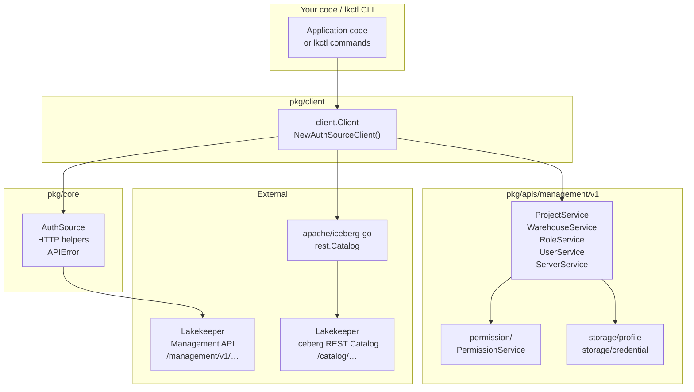
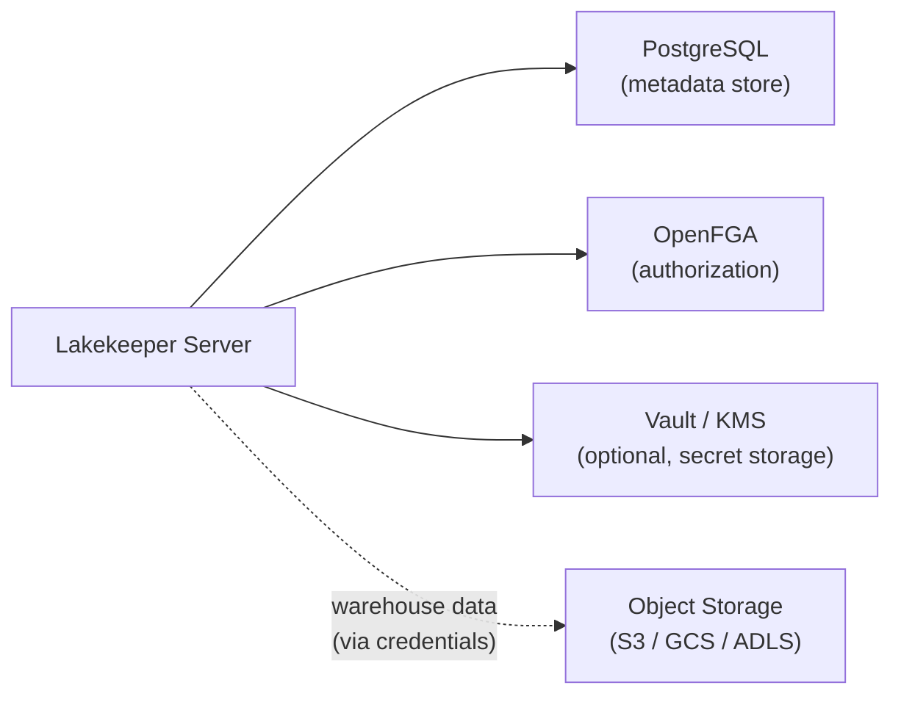
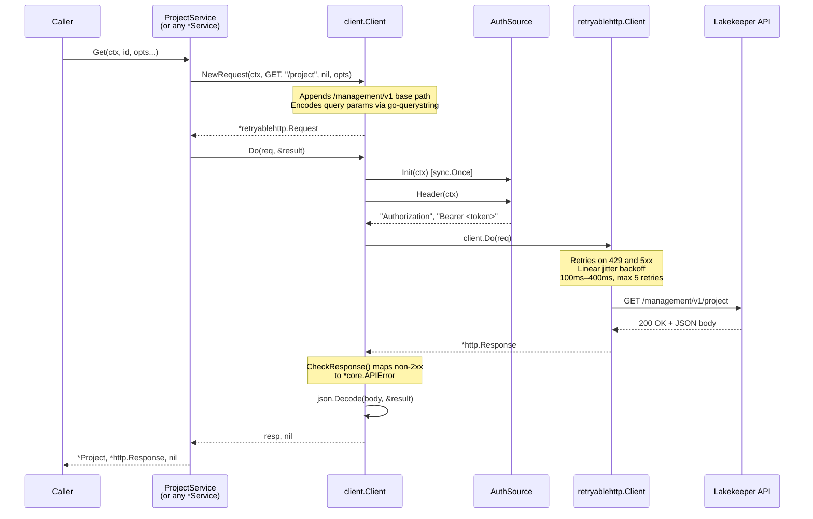

# Architecture

This document describes the high-level architecture of `go-lakekeeper`: a Go client SDK and CLI (`lkctl`) for the [Lakekeeper](https://docs.lakekeeper.io) Management and Iceberg REST Catalog APIs.

## Component Overview



The `client.Client` is the single entry point. It multiplexes calls to:

- **Management API** — via `ProjectV1()`, `WarehouseV1(projectID)`, `RoleV1(projectID)`, `UserV1()`, `ServerV1()`, `PermissionV1()`. All requests go through `pkg/core` for auth token injection and HTTP retry.
- **Iceberg REST Catalog** — via `CatalogV1(ctx, projectID, warehouse)`, which delegates to the upstream `apache/iceberg-go` REST client with the same auth token.

## Server-Side Context

`go-lakekeeper` is a **client** — it does not run any server-side components. For reference, the Lakekeeper server itself depends on:



The integration-test stack (`make test-integration`) brings up Lakekeeper + **Keycloak** (OIDC IdP) + **MinIO** (S3-compatible storage) + **OpenFGA** via `docker-compose`, which is the canonical reference environment for this SDK.

## Request Lifecycle

Every SDK call follows the same path from the service layer through the client to the wire.



Key points:

- `NewRequest` always prepends `/management/v1` to the path. The base URL is set once at client construction and never changes per-request.
- Auth headers are injected lazily in `Do()`: `Init` is called exactly once (via `sync.Once`), then `Header` is called on every request.
- The `retryablehttp` layer transparently retries `429 Too Many Requests` and any `>= 500` status with linear-jitter backoff. Retries can be disabled with `WithoutRetries()`.
- A non-2xx response is converted to `*core.APIError` by `CheckResponse`, but the raw `*http.Response` is still returned so callers can inspect status codes or headers.

## Bootstrap Flow

When `WithInitialBootstrapV1Enabled(true, isOperator, userType)` is passed to `NewAuthSourceClient`, the client calls `ServerV1().Info()` during construction and, if the server reports `bootstrapped: false`, calls `ServerV1().Bootstrap()` automatically. This happens exactly once per client instance via `sync.Once`.

## Project Scoping

Resources that belong to a project (warehouses, roles) are accessed via project-scoped service constructors:

```go
client.RoleV1(projectID).Get(ctx, roleID)
client.WarehouseV1(projectID).List(ctx, opts)
```

Internally these send the `x-project-id` header on each request (see `managementv1.WithProject`). Project-independent resources (`ServerV1()`, `UserV1()`, `ProjectV1()`) do not set this header.
