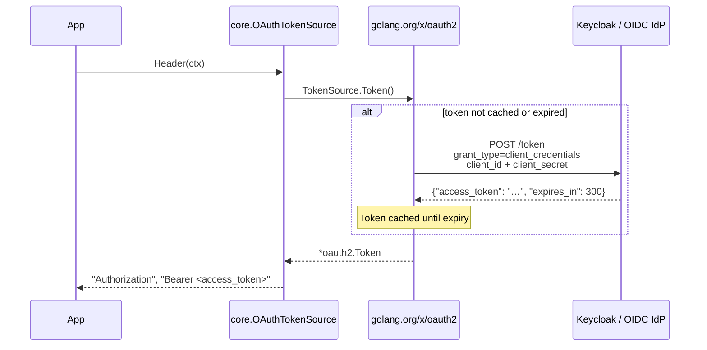
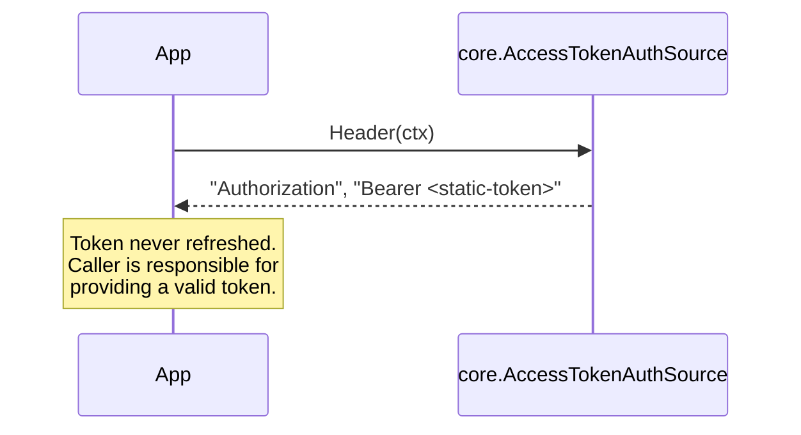
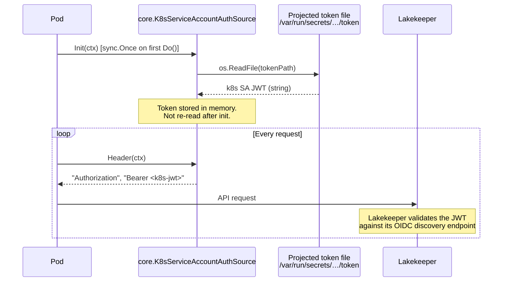

# Authentication

`go-lakekeeper` uses a pluggable `AuthSource` interface so that any credential mechanism can be swapped without changing application code. The `pkg/core` package defines the interface and ships three ready-made implementations.

## The `AuthSource` Interface

```go
type AuthSource interface {
    Init(context.Context) error
    Header(context.Context) (key, value string, err error)
    GetToken(context.Context) (string, error)
}
```

| Method | Called | Purpose |
|---|---|---|
| `Init` | Once, lazily on the first `Do()` call (`sync.Once`) | One-time setup — e.g. reading a file from disk |
| `Header` | Every request | Returns the `Authorization` header key+value to inject |
| `GetToken` | On demand | Returns a raw access token string; used by `CatalogV1()` to pass a token to `apache/iceberg-go` |

---

## `OAuthTokenSource` — OAuth 2.0 Client Credentials

The most common production choice. Wraps any `golang.org/x/oauth2.TokenSource`, which handles token caching and silent renewal automatically.

```go
import (
    "golang.org/x/oauth2/clientcredentials"
    "github.com/lakekeeper/go-lakekeeper/pkg/core"
    lakekeeper "github.com/lakekeeper/go-lakekeeper/pkg/client"
)

cfg := &clientcredentials.Config{
    ClientID:     "my-client",
    ClientSecret: "my-secret",
    TokenURL:     "https://keycloak.example.com/realms/iceberg/protocol/openid-connect/token",
    Scopes:       []string{"lakekeeper"},
}

as := &core.OAuthTokenSource{TokenSource: cfg.TokenSource(ctx)}
client, err := lakekeeper.NewAuthSourceClient(ctx, as, "https://lakekeeper.example.com")
```

### Flow



**Notes:**
- Token renewal is handled transparently by `golang.org/x/oauth2`. No manual refresh logic is needed.
- In the integration-test stack, the token endpoint is Keycloak at `http://localhost:30080/realms/iceberg/protocol/openid-connect/token`. Any OIDC-compliant IdP works in production.
- The scope `lakekeeper` is the default; adjust to match your IdP's Lakekeeper audience.

---

## `AccessTokenAuthSource` — Static Bearer Token

For short-lived scripts, tests, or environments where a token is obtained out-of-band.

```go
as := &core.AccessTokenAuthSource{Token: "eyJhbGci..."}
client, err := lakekeeper.NewAuthSourceClient(ctx, as, baseURL)
```

Or use the convenience constructor:

```go
client, err := lakekeeper.NewClient(ctx, "eyJhbGci...", baseURL)
```

### Flow



**Notes:**
- `Init` is a no-op.
- There is no expiry handling — if the token expires, requests will return 401. Use `OAuthTokenSource` for long-running processes.

---

## `K8sServiceAccountAuthSource` — Kubernetes Service Account

For workloads running inside a Kubernetes cluster. The projected service account token is mounted by the kubelet and read once at startup.

```go
// Default token path: /var/run/secrets/kubernetes.io/serviceaccount/token
as := &core.K8sServiceAccountAuthSource{}

// Or specify a custom path (e.g. for audience-scoped tokens)
path := "/var/run/secrets/lakekeeper/token"
as := &core.K8sServiceAccountAuthSource{ServiceAccountTokenPath: &path}

client, err := lakekeeper.NewAuthSourceClient(ctx, as, baseURL)
```

### Flow



**Notes:**
- The token is read from disk exactly once (`sync.Once`). If the kubelet rotates the projected token, the process must restart to pick up the new token.
- This implementation does **not** exchange the token with an IdP — it sends the raw k8s JWT directly. Lakekeeper must be configured to trust your cluster's OIDC issuer.
- For audience-scoped tokens (recommended), configure a `ServiceAccountToken` volume with a specific audience matching your Lakekeeper OIDC client.

---

## Choosing an `AuthSource`

| Scenario | Recommended `AuthSource` |
|---|---|
| Production service with an OIDC IdP (Keycloak, Dex, etc.) | `OAuthTokenSource` with `clientcredentials.Config` |
| Short-lived script or manual testing | `AccessTokenAuthSource` |
| Workload running inside Kubernetes | `K8sServiceAccountAuthSource` |
| Custom token logic (refresh token, device flow, etc.) | Implement `AuthSource` directly |

---

## CLI Authentication

The `lkctl` CLI always uses OAuth 2.0 client credentials. Credentials are read from flags or environment variables — see [CLI.md](CLI.md) for the full reference.
