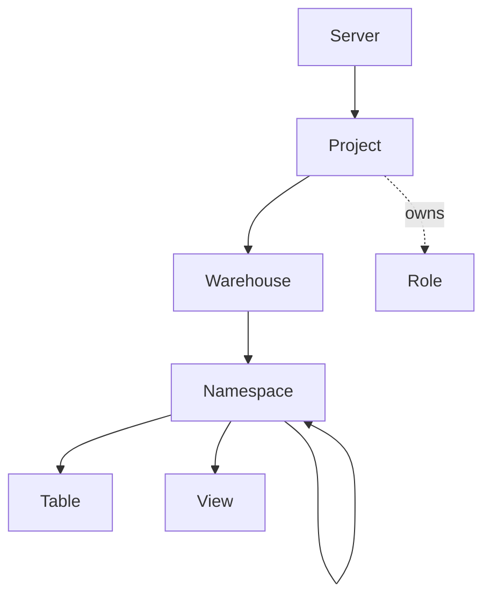

# Authorization

Once authenticated (see [AUTHENTICATION.md](AUTHENTICATION.md)), the next
question is what a principal is allowed to do. This guide covers the
Lakekeeper authorization model, the assignment values your code will
work with, and how to grant, revoke, and verify access from both
`lkctl` and the Go SDK.

For the canonical authorization reference — the resource model, the
Authorizer abstraction, and per-backend specifics (OpenFGA, Cedar, …) —
see the upstream
[Lakekeeper authorization docs](https://docs.lakekeeper.io/docs/nightly/authorization/).
This guide summarizes the parts you need to call the API; upstream owns
the canonical model.

## The Lakekeeper authorization model

Lakekeeper organises resources in a hierarchy. Permissions granted on a
parent cascade to children unless overridden.



**Principals.** Two kinds: **users** (human or application identities,
provisioned via `lkctl user create` / `c.UserAPI`) and **roles**
(first-class objects scoped to a project). Users can be assigned to
roles, and roles can themselves be granted permissions on resources —
so a single grant on a role propagates to every member.

**Roles.** A role is its own resource scoped to a project, with two
relations: `ownership` (manage the role itself) and `assignee` (members
who inherit its grants). A project can hold many independent roles.

**Grants and assignments.** A grant binds a principal (user or role)
to a relation — for example `select` — on a resource — for example a
specific warehouse. Each grant goes over the wire as
`{"type": <relation>, "user"|"role": <id>}` and is what
`lkctl … grant` and the SDK's `Update*Assignments` calls produce.
Effective access cascades through the resource hierarchy above.

**Pluggable backend.** Lakekeeper's Authorizer is configurable on the
server side — current options are AllowAll (dev/test), OpenFGA, and
custom implementations. The Management API surface, and therefore
everything in this guide, is identical across backends; only the set of
available *relations* and how access is computed may differ. The
defaults shown below match the OpenFGA backend, which is what the
integration stack runs today.

**Server-level admins** are the privileged principals that can manage
the server itself, including bootstrap and project creation. The first
principal to bootstrap a server (see
[AUTHENTICATION.md Bootstrap](AUTHENTICATION.md#bootstrap)) becomes the
operator and can grant `admin` to others.

## Common assignment values

The values below are the assignment **relations** — the strings passed
as `--assignments` on the CLI, or as the `relation` argument to
`permissions.BuildAssignment`. They are the discriminator values from
[`pkg/apis/management/v1/model_*_assignment.go`](../pkg/apis/management/v1/),
which match Lakekeeper's OpenFGA backend that the SDK is generated
against today. Other backends may expose a different set; consult the
upstream
[backend-specific guide](https://docs.lakekeeper.io/docs/nightly/authorization-openfga/)
for the canonical list.

### Server (`ServerAssignment`)

| Relation | Grants |
|---|---|
| `admin` | Full server-level administration |
| `operator` | Bootstrap rights and project creation |

### Project (`ProjectAssignment`)

| Relation | Grants |
|---|---|
| `project_admin` | Full administration of the project |
| `security_admin` | Manage roles and permissions inside the project |
| `data_admin` | Manage warehouses and their contents |
| `role_creator` | Create roles within the project |
| `describe` | Read project metadata |
| `select` | Read access (cascades to project resources) |
| `create` | Create child resources |
| `modify` | Modify project resources |

### Warehouse (`WarehouseAssignment`)

| Relation | Grants |
|---|---|
| `ownership` | Full control of the warehouse |
| `manage_grants` | Modify warehouse-level grants |
| `pass_grants` | Re-grant existing access to others |
| `describe` | Read warehouse metadata |
| `select` | Read tables/views in the warehouse |
| `create` | Create namespaces, tables, views |
| `modify` | Modify warehouse resources |

### Role (`RoleAssignment`)

| Relation | Grants |
|---|---|
| `ownership` | Manage the role itself (rename, delete, edit grants) |
| `assignee` | Membership — users/roles with `assignee` inherit the role's grants |

Namespace, Table, and View assignments mirror the warehouse set
(`ownership`, `manage_grants`, `pass_grants`, `describe`, `select`,
`create`, `modify`) at the relevant scope; see the corresponding
`model_<resource>_assignment*.go` files.

## Granting and revoking from `lkctl`

The verbs `grant`, `revoke`, `access`, and `assignments` follow the same
shape across `server`, `project`, `warehouse`, and `role`. The shared
mechanics:

- `--users`, `--roles` — repeatable / comma-separated principal IDs.
  Provide at least one; both can be set at once.
- `--assignments` — repeatable / comma-separated relations from the
  tables above. Required.
- `--user` / `--role` (singular) — only on `access`, mutually exclusive,
  scopes the access check to a specific principal.

For per-resource syntax see [CLI.md](CLI.md#command-tree) — the
[`server`](CLI.md#lkctl-server),
[`project`](CLI.md#lkctl-project),
[`warehouse`](CLI.md#lkctl-warehouse), and
[`role`](CLI.md#lkctl-role) sections each show full examples.

## Granting and revoking from the SDK

The generated `*Assignment` union types (`ServerAssignment`,
`ProjectAssignment`, `WarehouseAssignment`, `RoleAssignment`, …) all
share one wire shape: `{"type": <relation>, "user"|"role": <id>}`.
[`pkg/permissions`](../pkg/permissions/) provides two generic helpers
that work across every resource:

```go
import (
    managementv1 "github.com/lakekeeper/go-lakekeeper/pkg/apis/management/v1"
    "github.com/lakekeeper/go-lakekeeper/pkg/permissions"
)

a, err := permissions.BuildAssignment[managementv1.WarehouseAssignment](
    "select", permissions.PrincipalUser, userID,
)
```

`BuildAssignment[T]` produces a typed `*Assignment` value;
`DescribeAssignment(a)` projects any `*Assignment` back to a flat
`{PrincipalType, PrincipalID, Relation}`. Use them in pairs — the SDK
examples below all follow the same skeleton:

1. Build one or more `*Assignment` values for the relation(s) you want.
2. Append them to `req.Writes` (grant) or `req.Deletes` (revoke).
3. Call the right `c.PermissionsOpenfgaAPI.Update<Resource>Assignments…`
   method.
4. Verify with the matching `Get<Resource>Assignments…`.

The `PermissionsOpenfgaAPI` field name is a historical artifact of the
OpenAPI tag — it is just Lakekeeper's permissions service, regardless of
which Authorizer backend the server runs.

### Server

```go
req := managementv1.NewUpdateServerAssignmentsRequest()
a, err := permissions.BuildAssignment[managementv1.ServerAssignment](
    "admin", permissions.PrincipalUser, userID,
)
if err != nil {
    return err
}
req.Writes = append(req.Writes, a)

if _, err := c.PermissionsOpenfgaAPI.UpdateServerAssignments(ctx).
    UpdateServerAssignmentsRequest(*req).Execute(); err != nil {
    return fmt.Errorf("update server assignments: %w", err)
}

// Verify
resp, _, err := c.PermissionsOpenfgaAPI.GetServerAssignments(ctx).Execute()
```

### Project

`UpdateProjectAssignmentsById` accepts the project UUID; pass
`uuid.Nil.String()` for the default project.

```go
req := managementv1.NewUpdateProjectAssignmentsRequest()
a, err := permissions.BuildAssignment[managementv1.ProjectAssignment](
    "project_admin", permissions.PrincipalRole, roleID,
)
if err != nil {
    return err
}
req.Writes = append(req.Writes, a)

if _, err := c.PermissionsOpenfgaAPI.UpdateProjectAssignmentsById(ctx, projectID).
    UpdateProjectAssignmentsRequest(*req).Execute(); err != nil {
    return fmt.Errorf("update project assignments: %w", err)
}
```

### Warehouse

```go
req := managementv1.NewUpdateWarehouseAssignmentsRequest()
a, err := permissions.BuildAssignment[managementv1.WarehouseAssignment](
    "select", permissions.PrincipalRole, roleID,
)
if err != nil {
    return err
}
req.Writes = append(req.Writes, a)

if _, err := c.PermissionsOpenfgaAPI.UpdateWarehouseAssignmentsById(ctx, warehouseID).
    UpdateWarehouseAssignmentsRequest(*req).Execute(); err != nil {
    return fmt.Errorf("update warehouse assignments: %w", err)
}
```

### Role

Add a user to a role (so they inherit its grants) by writing an
`assignee` assignment:

```go
req := managementv1.NewUpdateRoleAssignmentsRequest()
a, err := permissions.BuildAssignment[managementv1.RoleAssignment](
    "assignee", permissions.PrincipalUser, userID,
)
if err != nil {
    return err
}
req.Writes = append(req.Writes, a)

if _, err := c.PermissionsOpenfgaAPI.UpdateRoleAssignmentsById(ctx, roleID).
    UpdateRoleAssignmentsRequest(*req).Execute(); err != nil {
    return fmt.Errorf("update role assignments: %w", err)
}
```

To revoke instead, use `req.Deletes = append(req.Deletes, a)` — same
shape, opposite slice.

## Reading effective access

**CLI.** `<resource> access [ID]` shows the actions allowed on a
resource. With no flag it reports the current principal; `--user` or
`--role` (mutually exclusive) scope the check to another principal.
`<resource> assignments [ID]` lists the raw grants on the resource.

```sh
lkctl warehouse access      <WAREHOUSE-ID>
lkctl warehouse access      <WAREHOUSE-ID> --user <USER-ID>
lkctl warehouse assignments <WAREHOUSE-ID>
```

**SDK.** Per-resource `Get<Resource>Access*` methods live on the
permissions service field — `c.PermissionsOpenfgaAPI`, kept under that
historical name from the OpenAPI tag. `c.AuthorizationAPI.BatchCheckActions`
covers batch checks across resource types.

```go
// Effective actions for the current principal on a warehouse.
resp, _, err := c.PermissionsOpenfgaAPI.GetWarehouseAccessById(ctx, warehouseID).
    Execute()

// Or scope to a specific principal:
resp, _, err = c.PermissionsOpenfgaAPI.GetWarehouseAccessById(ctx, warehouseID).
    PrincipalUser(userID).
    Execute()
```

`GetProjectAccessById` and `GetServerAccess` are flagged **Deprecated**
by the generator — replacement endpoints exist for the parameter-less
case. They remain the path the SDK and `lkctl` use today because the
`--user` / `--role` filter parity has not been migrated upstream yet.
Document and use them now; plan to migrate once the replacement covers
principal filters.

## End-to-end workflow

A complete bootstrap-to-grant scenario, shown on both surfaces. The
goal: a fresh server, a project, a role, a user assigned to that role,
and the role granted `select` on a warehouse.

| Step | `lkctl` | Go SDK |
|---|---|---|
| 1. Bootstrap | `lkctl server bootstrap --accept-terms-of-use --as-operator` | `client.NewWithAuthSource(ctx, baseURL, as, client.WithInitialBootstrap(true, true, core.Ptr(managementv1.USERTYPE_APPLICATION)))` |
| 2. Create project | `PROJECT_ID=$(lkctl project create my-project -o json \| jq -r '."project-id"')` | `created, _, err := c.ProjectAPI.CreateProject(ctx).CreateProjectRequest(*managementv1.NewCreateProjectRequest("my-project")).Execute()` |
| 3. Create role | `ROLE_ID=$(lkctl role create "data-readers" --project $PROJECT_ID -o json \| jq -r .id)` | `role, _, err := c.RoleAPI.CreateRole(ctx).XProjectId(projectID).CreateRoleRequest(*managementv1.NewCreateRoleRequest("data-readers")).Execute()` |
| 4. Add user to role | `lkctl role grant $ROLE_ID --users $USER_ID --assignments assignee` | Build `RoleAssignment{type: "assignee", user: USER_ID}` via `permissions.BuildAssignment`, post via `UpdateRoleAssignmentsById` |
| 5. Grant role on warehouse | `lkctl warehouse grant $WH_ID --roles $ROLE_ID --assignments select --project $PROJECT_ID` | Build `WarehouseAssignment{type: "select", role: ROLE_ID}`, post via `UpdateWarehouseAssignmentsById` |
| 6. Verify | `lkctl warehouse access $WH_ID --user $USER_ID` | `c.PermissionsOpenfgaAPI.GetWarehouseAccessById(ctx, WH_ID).PrincipalUser(USER_ID).Execute()` |

The SDK side, end-to-end, in one block. To keep the snippet focused, it
picks up after step 1 (the caller passes in a constructed `*client.Client`)
and assumes the user already exists — provision one via
`c.UserAPI.CreateUser(...)` if not. It also uses the default project
(`uuid.Nil`); replace `projectID` to target a named one and prepend the
matching `c.ProjectAPI.CreateProject(...)` call.

```go
import (
    "context"
    "fmt"

    "github.com/google/uuid"

    managementv1 "github.com/lakekeeper/go-lakekeeper/pkg/apis/management/v1"
    "github.com/lakekeeper/go-lakekeeper/pkg/client"
    "github.com/lakekeeper/go-lakekeeper/pkg/core"
    "github.com/lakekeeper/go-lakekeeper/pkg/permissions"
)

func provision(ctx context.Context, c *client.Client, userID, warehouseID string) error {
    // 2. Project (default project shown via uuid.Nil; replace for a named one)
    projectID := uuid.Nil.String()

    // 3. Role
    role, _, err := c.RoleAPI.CreateRole(ctx).
        XProjectId(projectID).
        CreateRoleRequest(*managementv1.NewCreateRoleRequest("data-readers")).
        Execute()
    if err != nil {
        return fmt.Errorf("create role: %w", err)
    }

    // 4. Add user as assignee of the role.
    roleAssign, err := permissions.BuildAssignment[managementv1.RoleAssignment](
        "assignee", permissions.PrincipalUser, userID,
    )
    if err != nil {
        return err
    }
    raReq := managementv1.NewUpdateRoleAssignmentsRequest()
    raReq.Writes = append(raReq.Writes, roleAssign)
    if _, err := c.PermissionsOpenfgaAPI.UpdateRoleAssignmentsById(ctx, role.Id).
        UpdateRoleAssignmentsRequest(*raReq).Execute(); err != nil {
        return fmt.Errorf("assign user to role: %w", err)
    }

    // 5. Grant the role `select` on the warehouse.
    whAssign, err := permissions.BuildAssignment[managementv1.WarehouseAssignment](
        "select", permissions.PrincipalRole, role.Id,
    )
    if err != nil {
        return err
    }
    whReq := managementv1.NewUpdateWarehouseAssignmentsRequest()
    whReq.Writes = append(whReq.Writes, whAssign)
    if _, err := c.PermissionsOpenfgaAPI.UpdateWarehouseAssignmentsById(ctx, warehouseID).
        UpdateWarehouseAssignmentsRequest(*whReq).Execute(); err != nil {
        return fmt.Errorf("grant select on warehouse: %w", err)
    }

    // 6. Verify.
    access, _, err := c.PermissionsOpenfgaAPI.GetWarehouseAccessById(ctx, warehouseID).
        PrincipalUser(userID).Execute()
    if err != nil {
        return fmt.Errorf("verify access: %w", err)
    }
    fmt.Printf("user %s allowed actions on warehouse %s: %+v\n", userID, warehouseID, access.AllowedActions)
    return nil
}
```

## See also

- [AUTHENTICATION.md](AUTHENTICATION.md) — choose an auth flow before
  reaching for grants
- [PACKAGES.md `pkg/permissions`](PACKAGES.md#pkgpermissions) —
  `BuildAssignment` / `DescribeAssignment` reference
- [CLI.md](CLI.md#command-tree) — full per-resource `grant` / `revoke`
  / `access` / `assignments` syntax
- Upstream [Lakekeeper authorization docs](https://docs.lakekeeper.io/docs/nightly/authorization/)
  — the Authorizer abstraction, backend-specific relation sets, and
  computed permissions
