# lkctl — CLI Reference

`lkctl` is the command-line interface for Lakekeeper. It is currently in **preview**; the command surface may change before a stable release.

## Installation

Download a pre-built binary from the [Releases page](https://github.com/lakekeeper/go-lakekeeper/releases/latest), or run via Docker:

```sh
docker run --rm quay.io/lakekeeper/lkctl version
```

To build from source:

```sh
make build          # produces dist/lkctl
# make build runs: mod → fmt → vet → test → go build
```

Other useful make targets:

| Target | Description |
|---|---|
| `make build` | Lint, test, then build `dist/lkctl` |
| `make validate` | `go vet` + `golangci-lint` (no build) |
| `make test` | Unit tests under `./pkg/…` with coverage |
| `make test-integration` | Spin up Lakekeeper + Keycloak + MinIO + OpenFGA via docker-compose and run integration tests |
| `make snapshot` | goreleaser snapshot (multi-arch, no publish) |
| `make clean` | Tear down compose stack and remove build artefacts |

---

## Global Flags & Environment Variables

Every `lkctl` command accepts these persistent flags. Environment variables or a `.env` file in the working directory can replace all flags.

| Flag | Env variable | Default | Description |
|---|---|---|---|
| `--server` | `LAKEKEEPER_SERVER` | `http://localhost:8181` | Lakekeeper base URL |
| `--auth-url` | `LAKEKEEPER_AUTH_URL` | _(none)_ | OAuth2 token endpoint |
| `--client-id` | `LAKEKEEPER_CLIENT_ID` | _(none)_ | OAuth2 `client_id` |
| `--client-secret` | `LAKEKEEPER_CLIENT_SECRET` | _(none)_ | OAuth2 `client_secret` |
| `--scopes` | `LAKEKEEPER_SCOPE` | `lakekeeper` | Space-separated OAuth2 scopes |
| `--bootstrap` | `LAKEKEEPER_BOOTSTRAP` | `false` | Auto-bootstrap server on startup |
| `--debug` | _(none)_ | `false` | Enable debug logging |

Example with environment variables:

```sh
export LAKEKEEPER_SERVER=http://localhost:8181
export LAKEKEEPER_AUTH_URL=http://localhost:30080/realms/iceberg/protocol/openid-connect/token
export LAKEKEEPER_CLIENT_ID=spark
export LAKEKEEPER_CLIENT_SECRET=2OR3eRvYfSZzzZ16MlPd95jhLnOaLM
export LAKEKEEPER_SCOPE=lakekeeper
```

---

## Command Tree

```mermaid
graph TD
    lkctl --> project
    lkctl --> warehouse["warehouse (alias: wh)"]
    lkctl --> role
    lkctl --> user
    lkctl --> server
    lkctl --> catalog["catalog ⚠️ not implemented"]
    lkctl --> version
    lkctl --> whoami

    project --> p-list[list]
    project --> p-get[get PROJECT-ID]
    project --> p-create[create NAME]
    project --> p-rename[rename PROJECT-ID NEW-NAME]
    project --> p-delete[delete PROJECT-ID]
    project --> p-access[access PROJECT-ID]
    project --> p-assignments[assignments PROJECT-ID]
    project --> p-grant[grant PROJECT-ID]

    warehouse --> w-list[list]
    warehouse --> w-get[get WAREHOUSE-ID]
    warehouse --> w-create[create NAME -f CONFIG.json]
    warehouse --> w-delete[delete WAREHOUSE-ID]

    role --> r-list[list]
    role --> r-get[get ROLE-ID]
    role --> r-create[create NAME]
    role --> r-update[update ROLE-ID]
    role --> r-delete[delete ROLE-ID]
    role --> r-access[access ROLE-ID]
    role --> r-assignments[assignments ROLE-ID]
    role --> r-grant[grant ROLE-ID]

    user --> u-list[list]
    user --> u-get[get USER-ID]
    user --> u-create[create]
    user --> u-delete[delete USER-ID]

    server --> s-info[info]
    server --> s-bootstrap[bootstrap]
    server --> s-access[access]
    server --> s-assignments[assignments]
    server --> s-grant[grant]
```



> **Note:** `lkctl catalog` exists as a placeholder but is not yet implemented — it exits with a fatal error. Use `client.CatalogV1()` from the Go SDK for catalog operations.

---

## Commands

### `lkctl server`

```sh
# Show server info (version, auth backend, bootstrap state)
lkctl server info

# Bootstrap the server (first-time setup)
lkctl server bootstrap --accept-terms-of-use --as-operator

# Or auto-bootstrap via the global flag (bootstraps if needed, then runs the command)
lkctl project list --bootstrap
```

---

### `lkctl project`

```sh
# List all projects
lkctl project list

# Get a project by ID
lkctl project get <PROJECT-ID>

# Create a project
PROJECT_ID=$(lkctl project create my-project | jq -r .)

# Rename a project
lkctl project rename <PROJECT-ID> new-name

# Delete a project
lkctl project delete <PROJECT-ID>

# Show allowed actions for the current user on a project
lkctl project access <PROJECT-ID>

# List role/user assignments on a project
lkctl project assignments <PROJECT-ID>

# Grant a role or user access to a project
lkctl project grant <PROJECT-ID> --user <USER-ID> --relations project_admin
```

---

### `lkctl warehouse`

Warehouses are project-scoped. Use `--project` / `-p` to specify the project UUID.

```sh
# List warehouses in a project
lkctl warehouse list --project <PROJECT-ID>

# Get a specific warehouse
lkctl warehouse get <WAREHOUSE-ID> --project <PROJECT-ID>

# Create a warehouse from a JSON config file
lkctl warehouse create "my-warehouse" -f warehouse-config.json --project <PROJECT-ID>

# Create from stdin
cat warehouse-config.json | lkctl warehouse create "my-warehouse" -f - --project <PROJECT-ID>

# Delete a warehouse
lkctl warehouse delete <WAREHOUSE-ID> --project <PROJECT-ID>
```

The `-f` flag accepts a JSON file that maps to `managementv1.CreateWarehouseOptions`. Example config:

```json
{
  "storage-profile": { ... },
  "storage-credential": { ... },
  "delete-profile": { "type": "hard" }
}
```

---

### `lkctl role`

Roles are project-scoped. Use `--project` / `-p`.

```sh
# List roles
lkctl role list --project <PROJECT-ID>

# Get a role
lkctl role get <ROLE-ID>

# Create a role
lkctl role create new-role --description "My role" --project <PROJECT-ID>

# Update a role
lkctl role update <ROLE-ID> --name updated-name

# Delete a role
lkctl role delete <ROLE-ID> --project <PROJECT-ID>

# Assign a role to a user
lkctl role grant <ROLE-ID> --user <USER-ID> --relations assignee

# List assignments for a role
lkctl role assignments <ROLE-ID>
```

---

### `lkctl user`

```sh
# List users
lkctl user list

# Get a user
lkctl user get <USER-ID>

# Create / provision a user
lkctl user create

# Delete a user
lkctl user delete <USER-ID>
```

---

### `lkctl version`

```sh
lkctl version
# Output: version, commit, date, tree state
```

---

### `lkctl whoami`

```sh
lkctl whoami
# Returns the identity of the authenticated principal
```

---

## Pagination

Commands that return lists accept `--limit` (default 100) and `--token` (page token from a previous response) for pagination:

```sh
lkctl project list --limit 10
lkctl project list --limit 10 --token <next-page-token>
```

---

## Output Format

Most commands support `--output json` (default for machine-readable output). Assignment listings use a tab-formatted table. Raw ID values (e.g., from `project create`) are printed as plain strings suitable for shell capture.
