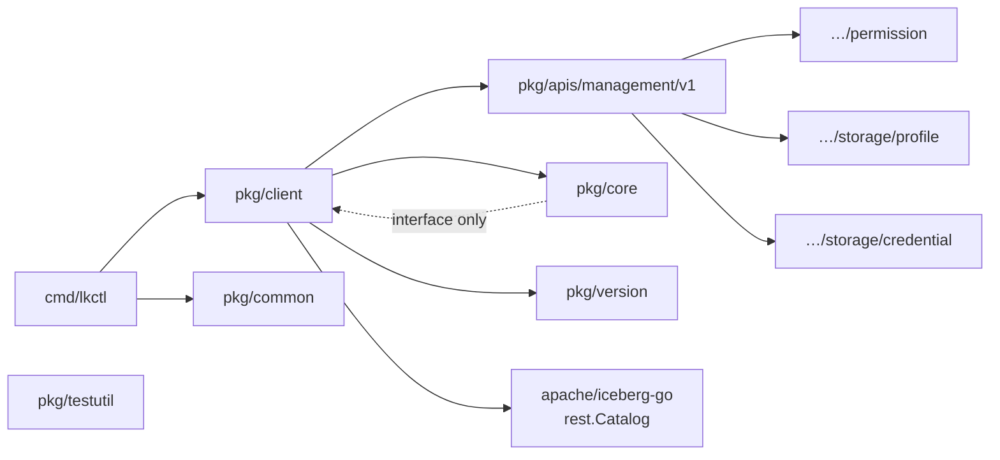

# Package Reference

This document describes every Go package in `go-lakekeeper` — its purpose, key types, and how the packages depend on each other.

## Dependency Graph



---

## `pkg/client`

**Import path:** `github.com/lakekeeper/go-lakekeeper/pkg/client`

The top-level facade. Almost all application code interacts with this package and nothing else.

### Key types

| Type | Description |
|---|---|
| `Client` | Main SDK client. Holds the retryablehttp client, base URL, AuthSource, and optional bootstrap config. |
| `ClientOptionFunc` | Functional option applied at construction time. |

### Entry points

```go
// Most common: pluggable auth
client, err := client.NewAuthSourceClient(ctx, authSource, baseURL, opts...)

// Convenience: static Bearer token
client, err := client.NewClient(ctx, token, baseURL, opts...)
```

### Service accessors

| Method | Returns | Scope |
|---|---|---|
| `ServerV1()` | `managementv1.ServerServiceInterface` | server-wide |
| `ProjectV1()` | `managementv1.ProjectServiceInterface` | server-wide |
| `UserV1()` | `managementv1.UserServiceInterface` | server-wide |
| `RoleV1(projectID)` | `managementv1.RoleServiceInterface` | per-project |
| `WarehouseV1(projectID)` | `managementv1.WarehouseServiceInterface` | per-project |
| `PermissionV1()` | `permissionv1.PermissionServiceInterface` | server-wide |
| `CatalogV1(ctx, projectID, warehouse, opts...)` | `*rest.Catalog, error` | per-warehouse |

### Client options

| Option | Effect |
|---|---|
| `WithInitialBootstrapV1Enabled(accept, isOperator, userType)` | Auto-bootstraps on first use if server is not yet bootstrapped |
| `WithoutRetries()` | Disables automatic retries |
| `WithCustomRetryMax(n)` | Sets maximum retry count (default: 5) |
| `WithCustomRetryWaitMinMax(min, max)` | Sets backoff window (default: 100ms–400ms) |
| `WithCustomBackoff(fn)` | Replaces the backoff algorithm |
| `WithCustomRetry(fn)` | Replaces the retry predicate |
| `WithHTTPClient(c)` | Replaces the underlying `*http.Client` |
| `WithRequestOptions(opts...)` | Adds default `RequestOptionFunc` to every request |
| `WithUserAgent(ua)` | Overrides the `User-Agent` header |
| `WithErrorHandler(fn)` | Replaces the retryablehttp error handler |

---

## `pkg/core`

**Import path:** `github.com/lakekeeper/go-lakekeeper/pkg/core`

Low-level HTTP primitives and the `AuthSource` abstraction. Nothing in this package imports other `go-lakekeeper` packages — it is the dependency bottom.

### Key types

| Type | Description |
|---|---|
| `AuthSource` | Interface: `Init(ctx)`, `Header(ctx) (key, value, err)`, `GetToken(ctx) (string, error)` |
| `OAuthTokenSource` | Wraps an `oauth2.TokenSource`; delegates token lifecycle to `golang.org/x/oauth2` |
| `AccessTokenAuthSource` | Static Bearer token; no expiry handling |
| `K8sServiceAccountAuthSource` | Reads a projected k8s SA token from disk at init time |
| `APIError` | Structured error returned by `Client.Do`; wraps HTTP status + body |
| `RequestOptionFunc` | `func(*retryablehttp.Request) error` — per-request header/query injection |
| `Client` | Interface that `client.Client` satisfies; used inside service implementations to avoid circular imports |

See [AUTHENTICATION.md](AUTHENTICATION.md) for a detailed breakdown of each `AuthSource` implementation.

---

## `pkg/apis/management/v1`

**Import path:** `github.com/lakekeeper/go-lakekeeper/pkg/apis/management/v1`  
**Linter alias:** `managementv1`

Hand-written bindings for the Lakekeeper Management API (`/management/v1`). Each resource has its own file with a service interface, a concrete service struct, and the request/response types.

### Services

| File | Interface | Operations |
|---|---|---|
| `server.go` | `ServerServiceInterface` | `Info`, `Bootstrap`, `GetAllowedActions` |
| `project.go` | `ProjectServiceInterface` | `Get`, `Create`, `Delete`, `List`, `Rename`, `GetAPIStatistics`, `GetAllowedActions` |
| `user.go` | `UserServiceInterface` | `Get`, `List`, `Search`, `Provision`, `Delete` |
| `role.go` | `RoleServiceInterface` | `Get`, `Create`, `Delete`, `Update`, `List` |
| `warehouse.go` | `WarehouseServiceInterface` | `List`, `Create`, `Get`, `Delete`, `Activate`, `Deactivate`, `Rename`, `UpdateStorageProfile`, `UpdateStorageCredential`, `UpdateDeleteProfile`, `SetWarehouseProtection`, `ListSoftDeletedTabulars`, `UndropTabular`, `GetStatistics`, `GetNamespaceProtection`, `SetNamespaceProtection`, `GetTableProtection`, `SetTableProtection`, `GetViewProtection`, `SetViewProtection`, `GetAllowedActions` |

### Shared utilities

| Symbol | Description |
|---|---|
| `APIManagementVersionPath` | Constant `/management/v1`; appended to base URL |
| `ProjectIDHeader` | Constant `x-project-id`; sent by project-scoped services |
| `WithProject(id)` | `RequestOptionFunc` that adds the `x-project-id` header |
| `ListOptions` | Shared pagination struct: `PageToken`, `PageSize` |

---

## `pkg/apis/management/v1/permission`

**Import path:** `github.com/lakekeeper/go-lakekeeper/pkg/apis/management/v1/permission`  
**Linter alias:** `permissionv1`

Manages role assignments and access-control actions across all resource types.

### Key files

| File | Content |
|---|---|
| `permission.go` | `PermissionServiceInterface` and `PermissionService` |
| `assignment.go` | `Assignment` interface; shared `GetPrincipalType`, `GetPrincipalID`, `GetAssignment` |
| `project.go` / `project_assignment.go` | Project-level actions and assignment types |
| `role.go` / `role_assignment.go` | Role-level actions and assignments |
| `server.go` / `server_assignment.go` | Server-level actions and assignments |
| `warehouse.go` / `warehouse_assignment.go` | Warehouse-level actions and assignments |
| `user_role.go` | User ↔ role relationship types |

---

## `pkg/apis/management/v1/storage/profile`

**Import path:** `github.com/lakekeeper/go-lakekeeper/pkg/apis/management/v1/storage/profile`  
**Linter alias:** `profilev1`

Storage profile builders for warehouse creation and updates. A storage profile describes _where_ data lives (bucket, region, endpoint).

Example:

```go
profile, err := profilev1.NewS3StorageSettings("my-bucket", "us-east-1",
    profilev1.WithEndpoint("http://minio:9000/"),
    profilev1.WithPathStyleAccess(),
)
opts.StorageProfile = profile.AsProfile()
```

---

## `pkg/apis/management/v1/storage/credential`

**Import path:** `github.com/lakekeeper/go-lakekeeper/pkg/apis/management/v1/storage/credential`  
**Linter alias:** `credentialv1`

Storage credential builders for warehouse creation and updates. A credential describes _how_ to authenticate to object storage (access key, assume-role, etc.).

Example:

```go
cred, err := credentialv1.NewS3CredentialAccessKey("access-key-id", "secret-access-key")
opts.StorageCredential = cred.AsCredential()
```

---

## `pkg/common`

**Import path:** `github.com/lakekeeper/go-lakekeeper/pkg/common`

Environment variable names and defaults shared between the CLI and any embedding code.

| Symbol | Value |
|---|---|
| `EnvServer` | `LAKEKEEPER_SERVER` |
| `EnvAuthURL` | `LAKEKEEPER_AUTH_URL` |
| `EnvClientID` | `LAKEKEEPER_CLIENT_ID` |
| `EnvClientSecret` | `LAKEKEEPER_CLIENT_SECRET` |
| `EnvScope` | `LAKEKEEPER_SCOPE` |
| `EnvBootstrap` | `LAKEKEEPER_BOOTSTRAP` |
| `DefaultServer` | `http://localhost:8181` |
| `DefaultScope` | `["lakekeeper"]` |

---

## `pkg/version`

**Import path:** `github.com/lakekeeper/go-lakekeeper/pkg/version`

Build-time version info injected via `ldflags` by goreleaser and `make build`. Returns a struct with `Version`, `Commit`, `Date`, and `TreeState`. The `User-Agent` header sent by `client.Client` is `go-lakekeeper/<version>`.

---

## `pkg/testutil`

**Import path:** `github.com/lakekeeper/go-lakekeeper/pkg/testutil`

Test helpers shared across unit and integration tests. Not intended for use outside tests.

---

## `cmd/lkctl`

The CLI binary entry point. Delegates immediately to `cmd/lkctl/commands.NewCommand()` which builds the Cobra command tree. See [CLI.md](CLI.md) for the full command reference.
