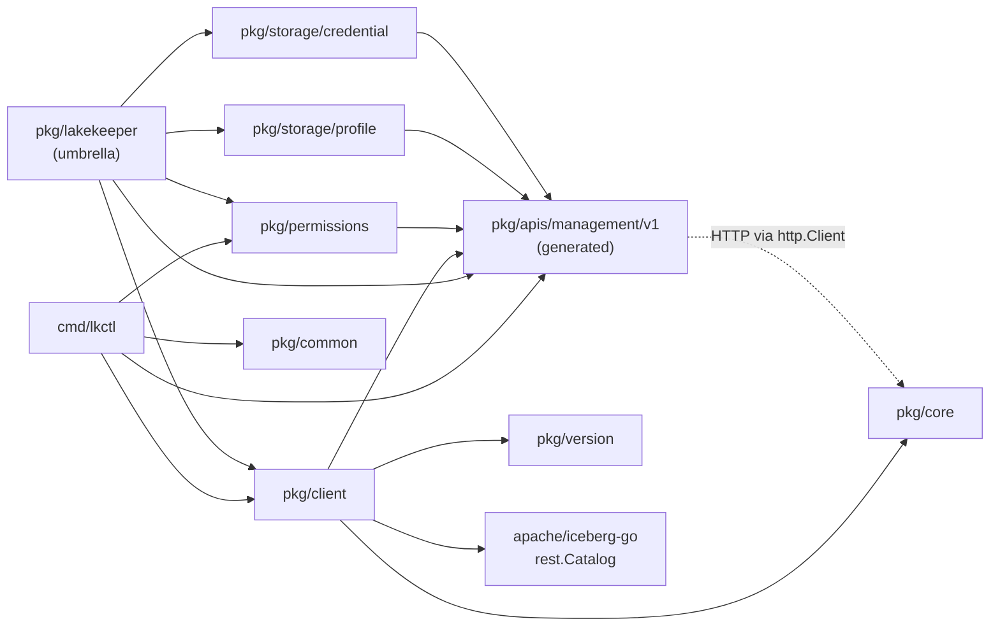
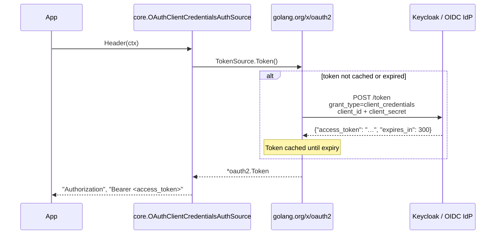

# Package Reference

Every Go package in `go-lakekeeper` — its purpose, key types, and how the
packages depend on each other. Complements [GENERATION.md](GENERATION.md)
(which covers the generated/manual split) and [ARCHITECTURE.md](ARCHITECTURE.md)
(which covers the request lifecycle).

## Dependency Graph



The generated `pkg/apis/management/v1` package is the dependency root —
nothing else in this module imports it transitively without going through
the typed packages above. `pkg/client` wires it up with auth and retries;
`pkg/permissions` and `pkg/storage/*` provide ergonomic builders on top of
its types; and `pkg/lakekeeper` re-exports a curated subset of all four for
single-import call sites.

---

## Building requests

Most request types are constructed through a generator-emitted
`New<Resource>Request` constructor that takes only the spec-required fields
positionally, plus `Set<Field>(value)` mutators for everything else:

```go
req := managementv1.NewCreateWarehouseRequest(sp, "main")  // required: profile, name
req.SetProjectId(projectID)                                // optional
req.SetStorageCredential(sc)                               // optional
```

This is mildly more verbose than the AWS SDK's struct-literal idiom
(`&ec2.RunInstancesInput{...}`). The trade-off is that the `Set*` mutators
absorb the `*string`/`*bool` ceremony for optional scalars — `req.SetDescription("x")`
takes a value, the mutator stores `&v` internally. If you'd rather use
struct literals, you can; you just have to wrap optional scalars yourself
(`Description: managementv1.PtrString("x")` or with a `s := "x"; ... &s`
temp). The setters are the recommended idiom for that reason.

For request types whose only required input is the body itself
(`SetProtectionRequest`, `RenameWarehouseRequest`, …), the umbrella's
`New<Resource>Request` is a simple value constructor with no setters
afterwards.

---

## `pkg/lakekeeper` (umbrella)

**Import path:** `github.com/lakekeeper/go-lakekeeper/pkg/lakekeeper`

Convenience umbrella that re-exports the most-used types and constructors
from `pkg/client`, `pkg/storage/{profile,credential}`, `pkg/permissions`,
and a curated subset of `pkg/apis/management/v1`. The goal is a single
import for the common call site:

```go
import "github.com/lakekeeper/go-lakekeeper/pkg/lakekeeper"

c, err := lakekeeper.New(ctx, baseURL, token)
sp := lakekeeper.NewS3Profile("bucket", "us-east-1",
    lakekeeper.WithS3Endpoint("http://minio:9000"))
sc := lakekeeper.NewS3AccessKey("ak", "sk")

req := lakekeeper.NewCreateWarehouseRequest(sp, "main")
req.SetProjectId(projectID)
req.SetStorageCredential(sc)

wh, err := c.Warehouses.Create(ctx, req)
```

What it re-exports:
- `Client`, `Option`, and every constructor from [`pkg/client`](#pkgclient).
- All profile and credential builders from `pkg/storage/{profile,credential}`.
- Permission helpers (`PrincipalSet`, `BuildAssignment`,
  `BuildAssignmentSet`, `DescribeAssignment`).
- Common request and response types — `Warehouse`, `Project`, `Role`,
  `User`, `CreateWarehouseRequest`, `*Assignment` family, etc. — as
  identity-preserving aliases. Values flow between the umbrella and the
  underlying `managementv1` import without conversion.

What it does **not** re-export:
- The full ~189-schema Management API surface. Reach for `managementv1`
  when you need a less-common type.
- Generated enum constants. Use `managementv1.<EnumValue>` directly; the
  preprocessor produces idiomatic Go names there
  (`managementv1.WarehouseStatusActive`, `managementv1.S3FlavorAws`),
  so an alias would only add a second name for the same value.

The umbrella is a thin file (~150 LoC) that runs `go vet` clean and
provides no behaviour of its own — every symbol resolves through
`type X = …` aliases or `var X = …` function-value references.

---

## `pkg/client`

**Import path:** `github.com/lakekeeper/go-lakekeeper/pkg/client`

The top-level facade. `Client` embeds the generated
`*managementv1.APIClient`, so each generated service handle is reachable as
a public field directly on `Client`. The facade adds auth wiring (via
`core.AuthSource` and a custom `http.RoundTripper`), optional retry
behaviour, optional bootstrap on construction, and a `CatalogV1` helper
that delegates to `apache/iceberg-go`.

### Constructors

```go
// Static OAuth bearer token.
client, err := client.New(ctx, baseURL, token, options...)

// Pluggable auth via AuthSource.
client, err := client.NewWithAuthSource(ctx, baseURL, authSource, options...)
```

`AuthSource.Init` is invoked **once during construction** — no lazy
initialisation on the first request.

### Resource façades (one-call ergonomic surface)

For the common case — single-body request, single-response result — reach
for the resource façades on `*Client`. Each one compresses the generator's
three-call fluent pattern (`c.WarehouseAPI.X(ctx).Body(*req).Execute()`)
into a single method call returning `(value, error)` instead of the
generator's `(value, *http.Response, error)` triple.

| Field | Purpose |
|---|---|
| `c.Warehouses` | Create / Get / Delete / List / Rename / Activate / Deactivate / SetProtection / Statistics |
| `c.Projects` | Create / Get / Delete / List / Rename |
| `c.Roles` | Create / Get / Delete / List / Update (project-scoped) |
| `c.Users` | Create / Get / Delete / List / Update / Whoami |
| `c.Server` | Info / Bootstrap |

```go
wh, err := c.Warehouses.Create(ctx, req)         // façade — one call
wh, _, err := c.WarehouseAPI.CreateWarehouse(ctx). // generator — full control
    CreateWarehouseRequest(*req).Execute()
```

The façades cover roughly 90% of `lkctl`'s call sites. For endpoints with
extra query params, custom request options, or where you need the raw
`*http.Response`, reach for the embedded generated service handles below.

### Embedded service handles (generator-shaped fluent surface)

Every generated service is exposed as a field on `*Client`:

| Field | Purpose |
|---|---|
| `c.ServerAPI` | Server info, bootstrap |
| `c.ProjectAPI` | Projects |
| `c.UserAPI` | Users |
| `c.RoleAPI` | Roles |
| `c.WarehouseAPI` | Warehouses, namespaces, tabular protections |
| `c.PermissionsOpenfgaAPI` | Assignments and access checks |
| `c.AuthorizationAPI` | Authorization metadata |
| `c.TasksAPI` | Background task introspection |

Project-scoping (where the API needs `x-project-id`) is handled by passing
the project ID into the relevant generated method — see the godoc on each
service for specifics.

### Catalog helper

```go
catalog, err := client.CatalogV1(ctx, projectID, warehouse, opts...)
```

Returns an `*apache/iceberg-go/catalog/rest.Catalog` configured with the
client's auth token and the warehouse-scoped catalog URL.

### Options

| Option | Effect |
|---|---|
| `WithUserAgent(ua)` | Override the `User-Agent` header (default: `go-lakekeeper/<version>`) |
| `WithoutRetries()` | Disable the retry layer entirely |
| `WithRetryMax(n)` | Override the maximum retry count |
| `WithRetryWait(min, max)` | Override the backoff window |
| `WithCheckRetry(fn)` | Replace `retryablehttp`'s retry predicate |
| `WithBackoff(fn)` | Replace `retryablehttp`'s backoff algorithm |
| `WithErrorHandler(fn)` | Replace `retryablehttp`'s error handler |
| `WithInitialBootstrap(acceptTermsOfUse, isOperator, userType)` | Auto-bootstrap on first construction if the server is not yet bootstrapped. No-op when `acceptTermsOfUse` is false |

---

## `pkg/core`

**Import path:** `github.com/lakekeeper/go-lakekeeper/pkg/core`

Low-level HTTP primitives. Imports nothing else from this module; sits at
the dependency root alongside the generated client.

### Authentication

For a flow-by-flow guide that pairs each implementation below with the
equivalent `lkctl` setup, see [AUTHENTICATION.md](AUTHENTICATION.md).

`AuthSource` is the pluggable auth interface — any credential mechanism can
be swapped without changing application code.

```go
type AuthSource interface {
    Init(context.Context) error
    Header(context.Context) (key, value string, err error)
    GetToken(context.Context) (string, error)
}
```

| Method | Called | Purpose |
|---|---|---|
| `Init` | Once, eagerly during `client.NewWithAuthSource` | One-time setup — e.g. reading a file from disk |
| `Header` | Every request, by `AuthRoundTripper` | Returns the `Authorization` header key+value to inject |
| `GetToken` | On demand | Returns a raw access token; used by `Client.CatalogV1` to pass a token to `apache/iceberg-go` |

Three implementations ship in the package.

Each implementation's `Init` validates eagerly: a misconfigured token URL,
empty bearer, or unreadable service-account file surfaces as an error
from `client.NewWithAuthSource` rather than as a deferred 401 on the
first API call.

#### `OAuthClientCredentialsAuthSource` — OAuth 2.0 client credentials

The most common production choice. Wraps any
`golang.org/x/oauth2.TokenSource`, which handles token caching and silent
renewal before expiry automatically (via `oauth2.ReuseTokenSource`).

The umbrella's `lakekeeper.NewOAuthClientCredentials` is the shortest
construction path:

```go
import "github.com/lakekeeper/go-lakekeeper/pkg/lakekeeper"

c, err := lakekeeper.NewOAuthClientCredentials(ctx,
    "https://lakekeeper.example.com",
    "https://keycloak.example.com/realms/iceberg/protocol/openid-connect/token",
    "my-client", "my-secret",
    []string{"lakekeeper"})
```

The lower-level shape, when you need to pass a pre-built `oauth2.TokenSource`
(auth-code, device flow, refresh-only) or attach extra `client.Option`s:

```go
import (
    "golang.org/x/oauth2/clientcredentials"

    "github.com/lakekeeper/go-lakekeeper/pkg/client"
    "github.com/lakekeeper/go-lakekeeper/pkg/core"
)

cfg := &clientcredentials.Config{ /* … */ }
as := &core.OAuthClientCredentialsAuthSource{TokenSource: cfg.TokenSource(ctx)}
c, err := client.NewWithAuthSource(ctx, baseURL, as)
```



The struct technically accepts any `oauth2.TokenSource`, so non-client-credentials
flows (auth-code, device, refresh-only) work too. The type name is
specific to client-credentials because that is the only flow the SDK
documents and tests; if you need another flow, build the `oauth2.TokenSource`
yourself or implement `AuthSource` directly.

#### `AccessTokenAuthSource` — static bearer token

For short-lived scripts, tests, or environments where a token is obtained
out-of-band.

```go
as := &core.AccessTokenAuthSource{Token: "eyJhbGci..."}
c, err := client.NewWithAuthSource(ctx, baseURL, as)

// Or, equivalently:
c, err := client.New(ctx, baseURL, "eyJhbGci...")
```

`Init` rejects an empty token. There is no expiry handling — once the
token expires, requests return 401. Use `OAuthClientCredentialsAuthSource`
for long-running processes.

#### `K8sServiceAccountAuthSource` — Kubernetes service account

For workloads running inside a Kubernetes cluster. The projected service-account
token is mounted by the kubelet and **re-read on every request**, so the
hourly rotation is picked up without process restart.

The umbrella's `lakekeeper.NewK8sServiceAccount` is the shortest path:

```go
import "github.com/lakekeeper/go-lakekeeper/pkg/lakekeeper"

// Default token path: /var/run/secrets/kubernetes.io/serviceaccount/token
c, err := lakekeeper.NewK8sServiceAccount(ctx, baseURL, "")

// Or specify a custom path (e.g. for audience-scoped tokens)
c, err = lakekeeper.NewK8sServiceAccount(ctx, baseURL, "/var/run/secrets/lakekeeper/token")
```

The lower-level shape:

```go
as := &core.K8sServiceAccountAuthSource{}                            // default path
as := &core.K8sServiceAccountAuthSource{ServiceAccountTokenPath: &p} // custom

c, err := client.NewWithAuthSource(ctx, baseURL, as)
```

`Init` validates the token file is readable at construction. Subsequent
`Header` calls re-read on each request — file reads against tmpfs are
sub-microsecond, and the kubelet writes via atomic rename, so partial
reads are impossible. Lakekeeper must be configured to trust your
cluster's OIDC issuer; the auth source sends the raw k8s JWT directly
without exchanging it through an IdP.

#### Choosing an `AuthSource`

| Scenario | Recommended |
|---|---|
| Production service with an OIDC IdP (Keycloak, Dex, …) | `OAuthClientCredentialsAuthSource` (or `lakekeeper.NewOAuthClientCredentials`) |
| Short-lived script or manual testing | `AccessTokenAuthSource` (or `lakekeeper.New`) |
| Workload running inside Kubernetes | `K8sServiceAccountAuthSource` (or `lakekeeper.NewK8sServiceAccount`) |
| Custom token logic (refresh token, device flow, …) | Build an `oauth2.TokenSource` or implement `AuthSource` directly |

### Other types in `pkg/core`

| Type / function | Description |
|---|---|
| `AuthRoundTripper` | `http.RoundTripper` that injects the `AuthSource`'s header on every outbound request. Used by `pkg/client` to wire auth into the generated client's underlying `*http.Client` |
| `RequestOptionFunc`, `WithHeader`, `WithHeaders`, `WithContext`, `WithQueryParams` | Per-request modifiers |
| `APIError`, `APIErrorFromResponse`, `APIErrorFromError`, `APIErrorFromMessage` | Structured error type plus factories |
| `Ptr[T any](v T) *T` | Convenience helper for taking the address of a literal — useful when calling generated setters that expect `*T` |

---

## `pkg/apis/management/v1`

**Import path:** `github.com/lakekeeper/go-lakekeeper/pkg/apis/management/v1`
**Linter alias:** `managementv1` (enforced by `importas` in `.golangci.yml`)

**This package is generated from the OpenAPI spec.** See
[GENERATION.md](GENERATION.md) for the full picture.

It contains the generated `*APIClient`, per-resource `*APIService` types
(`ProjectAPIService`, `WarehouseAPIService`, `RoleAPIService`,
`UserAPIService`, `ServerAPIService`, `PermissionsOpenfgaAPIService`,
`AuthorizationAPIService`, `TasksAPIService`), and a few hundred model
types (one file per model, prefix `model_`).

The generated client is normally accessed through
[`pkg/client`](#pkgclient) rather than instantiated directly. Use the
embedded service fields on `*client.Client` for routine operations, and
reach for the raw `managementv1` types when constructing requests
(e.g. `managementv1.NewBootstrapRequest(true)`).

---

## `pkg/permissions`

**Import path:** `github.com/lakekeeper/go-lakekeeper/pkg/permissions`

For the authorization model, common assignment values, and end-to-end
grant/revoke workflows, see [AUTHORIZATION.md](AUTHORIZATION.md).

Generic helpers on top of the generated `*Assignment` union types. Every
resource-specific assignment in the generated client (`ServerAssignment`,
`ProjectAssignment`, `WarehouseAssignment`, `RoleAssignment`, …)
serializes to the same wire shape: `{"type": <relation>, "user"|"role": <id>}`.
This package consumes and produces that shape generically, so callers don't
hard-code which discriminator branch each relation belongs to.

| Symbol | Description |
|---|---|
| `PrincipalKind` (constants `PrincipalUser`, `PrincipalRole`) | Wire-format principal discriminator |
| `PrincipalSet` | `{Users []string; Roles []string}` for multi-relation grant/revoke |
| `AssignmentRow` | Flattened `{PrincipalType, PrincipalID, Relation}` projection used by display layers |
| `BuildAssignment[T any](relation string, kind PrincipalKind, id string) (T, error)` | Builds a typed `*Assignment` for any resource by JSON-roundtripping the wire shape into the union's generated `UnmarshalJSON` |
| `BuildAssignmentSet[T any](relations []string, set PrincipalSet) ([]T, error)` | Expands `relations × (set.Users + set.Roles)` into a slice of `*Assignment` values for assignment to a request's `Writes` (grant) or `Deletes` (revoke) field. Replaces the four-line nested loop that previously appeared at every grant/revoke call site |
| `DescribeAssignment(a any) (AssignmentRow, bool)` | Inverse of `BuildAssignment` — extracts the wire shape from any `*Assignment` value |

The `lkctl` `grant` / `revoke` / `assignments` subcommands use these
helpers; see [`cmd/lkctl/commands/`](../cmd/lkctl/commands/) for examples.

### Relation strings

`BuildAssignment` / `BuildAssignmentSet` take the relation as a `string`
to keep them resource-generic, but the spec exports a typed enum per
resource: `managementv1.WarehouseRelation`, `ProjectRelation`,
`RoleRelation`, `ServerRelation`, `NamespaceRelation`, `TableRelation`,
`ViewRelation`. Their constants
(`managementv1.WarehouseRelationOwnership`,
`managementv1.ProjectRelationDescribe`, …) are typed strings that pass
straight in via conversion:

```go
writes, err := permissions.BuildAssignmentSet[managementv1.WarehouseAssignment](
    []string{string(managementv1.WarehouseRelationOwnership)},
    permissions.PrincipalSet{Users: []string{userID}},
)
```

Using the constants instead of bare `"ownership"` literals catches typos
at compile time when the spec eventually changes a relation name. The
SDK still accepts arbitrary strings so a relation introduced server-side
before a client regen can be passed without a code change.

---

## `pkg/storage/profile`

**Import path:** `github.com/lakekeeper/go-lakekeeper/pkg/storage/profile`

Ergonomic builders for the `StorageProfile{S3,Gcs,Adls}` variants emitted
by the generator. Each provider has a `New<Provider>Profile` constructor
that takes the spec-mandated fields positionally and accepts a variadic
list of `With*` options for the optional ones.

```go
import "github.com/lakekeeper/go-lakekeeper/pkg/storage/profile"

sp := profile.NewS3Profile("my-bucket", "us-east-1",
    profile.WithS3Endpoint("http://minio:9000"),
    profile.WithS3PathStyleAccess(),
)
req.StorageProfile = sp
```

Constructors return the `managementv1.StorageProfile` umbrella union
directly — callers pass the value straight to request setters without an
intermediate `…AsStorageProfile` wrap step.

For the read direction, use the `As*` accessors — symmetric with the
builders:

```go
wh, err := c.Warehouses.Get(ctx, id)

if s3, ok := profile.AsS3(wh.StorageProfile); ok {
    fmt.Println(s3.Bucket, s3.Region)
}
```

The accessors return `(*<variant>, false)` when the union holds a
different variant, replacing the
`if wh.StorageProfile.StorageProfileS3 != nil { … }` ladder.

`profile.AsS3` / `AsGCS` / `AsADLS` and `credential.AsS3AccessKey` /
`AsS3AwsSystemIdentity` / etc. are also re-exported from the umbrella as
`lakekeeper.AsS3Profile` etc.

---

## `pkg/storage/credential`

**Import path:** `github.com/lakekeeper/go-lakekeeper/pkg/storage/credential`

Ergonomic builders for the `StorageCredential` variants. Unlike `profile`,
these constructors return the umbrella `managementv1.StorageCredential`
union directly, because the credential variants don't usually need
additional options.

```go
import "github.com/lakekeeper/go-lakekeeper/pkg/storage/credential"

cred := credential.NewS3AccessKey("access-key-id", "secret-access-key")
req.SetStorageCredential(cred)
```

Available constructors include `NewS3AccessKey`,
`NewS3AccessKeyWithExternalID`, `NewS3AwsSystemIdentity`,
`NewS3CloudflareR2`, `NewGCSServiceAccountKey`, `NewGCSSystemIdentity`,
`NewAZClientCredentials`, `NewAZSharedAccessKey`, and
`NewAZManagedIdentity`. See
[`pkg/storage/credential/`](../pkg/storage/credential/) for the full list.

---

## `pkg/apis/management/v1tests`

**Import path:** `github.com/lakekeeper/go-lakekeeper/pkg/apis/management/v1tests`

Wire-format round-trip tests for the generated assignment models. Lives
**outside** `pkg/apis/management/v1/` so test fixtures don't bleed into the
generated package (which is rebuilt wholesale by `make generate`).

When the OpenAPI preprocessor changes shape, the tests in here are the
fastest signal that something has broken.

---

## `pkg/common`

**Import path:** `github.com/lakekeeper/go-lakekeeper/pkg/common`

Environment-variable names and defaults shared between the CLI and any
embedding code.

| Symbol | Value |
|---|---|
| `EnvBaseURL` | `LAKEKEEPER_BASE_URL` |
| `EnvTokenURL` | `LAKEKEEPER_TOKEN_URL` |
| `EnvClientID` | `LAKEKEEPER_CLIENT_ID` |
| `EnvClientSecret` | `LAKEKEEPER_CLIENT_SECRET` |
| `EnvScope` | `LAKEKEEPER_SCOPE` |
| `EnvBootstrap` | `LAKEKEEPER_BOOTSTRAP` |
| `DefaultBaseURL` | `http://localhost:8181` |
| `DefaultScope` | `["lakekeeper"]` |

---

## `pkg/version`

**Import path:** `github.com/lakekeeper/go-lakekeeper/pkg/version`

Build-time version info injected via `ldflags` by goreleaser and
`make build`. Returns a struct with `Version`, `Commit`, `Date`, and
`TreeState`. The `User-Agent` header sent by `client.Client` is
`go-lakekeeper/<version>`.

---

## `pkg/testutil`

**Import path:** `github.com/lakekeeper/go-lakekeeper/pkg/testutil`

Test helpers shared across unit and integration tests. Not intended for
use outside tests.

---

## `cmd/lkctl`

The CLI binary entry point. Delegates immediately to
`cmd/lkctl/commands.NewCommand()`, which builds the Cobra command tree.
See [CLI.md](CLI.md) for the full command reference.
