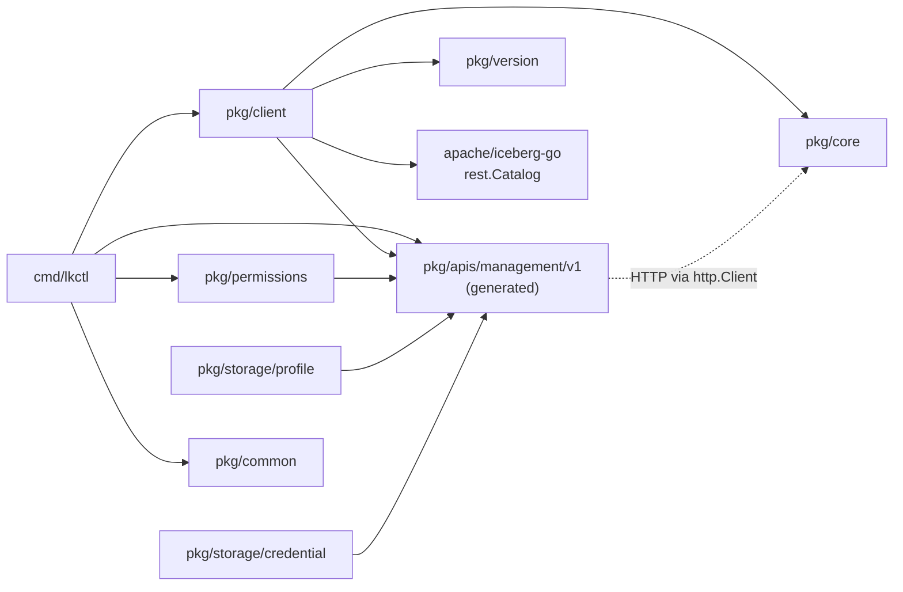
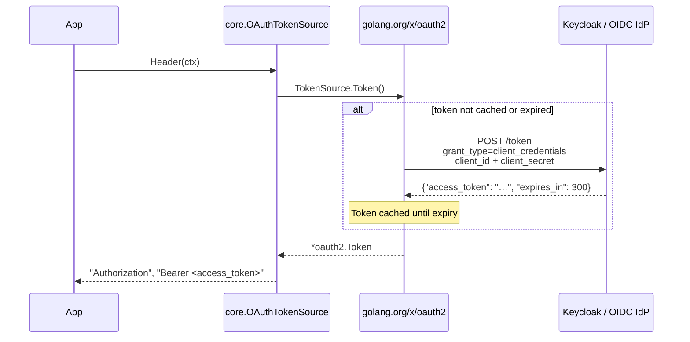

# Package Reference

Every Go package in `go-lakekeeper` — its purpose, key types, and how the
packages depend on each other. Complements [GENERATION.md](GENERATION.md)
(which covers the generated/manual split) and [ARCHITECTURE.md](ARCHITECTURE.md)
(which covers the request lifecycle).

## Dependency Graph



The generated `pkg/apis/management/v1` package is the only one that imports
no other repo package — it's the dependency root. `pkg/client` wires it up
with auth and retries; `pkg/permissions` and `pkg/storage/*` provide
ergonomic builders on top of its types.

---

## `pkg/client`

**Import path:** `github.com/lakekeeper/go-lakekeeper/pkg/client`

The top-level facade. `Client` embeds the generated
`*managementv1.APIClient`, so each generated service handle is reachable as
a public field directly on `Client`. The facade adds auth wiring (via
`core.AuthSource` and a custom `http.RoundTripper`), optional retry
behaviour, optional bootstrap on construction, and a `CatalogV1` helper
that delegates to `apache/iceberg-go`.

### Constructors

```go
// Static OAuth bearer token.
client, err := client.New(ctx, baseURL, token, options...)

// Pluggable auth via AuthSource.
client, err := client.NewWithAuthSource(ctx, baseURL, authSource, options...)
```

`AuthSource.Init` is invoked **once during construction** — no lazy
initialisation on the first request.

### Embedded service handles

The generated services are exposed as fields on `*Client`:

| Field | Purpose |
|---|---|
| `c.ServerAPI` | Server info, bootstrap |
| `c.ProjectAPI` | Projects |
| `c.UserAPI` | Users |
| `c.RoleAPI` | Roles |
| `c.WarehouseAPI` | Warehouses, namespaces, tabular protections |
| `c.PermissionsOpenfgaAPI` | Assignments and access checks |
| `c.AuthorizationAPI` | Authorization metadata |
| `c.TasksAPI` | Background task introspection |

Project-scoping (where the API needs `x-project-id`) is handled by passing
the project ID into the relevant generated method — see the godoc on each
service for specifics.

### Catalog helper

```go
catalog, err := client.CatalogV1(ctx, projectID, warehouse, opts...)
```

Returns an `*apache/iceberg-go/catalog/rest.Catalog` configured with the
client's auth token and the warehouse-scoped catalog URL.

### Options

| Option | Effect |
|---|---|
| `WithUserAgent(ua)` | Override the `User-Agent` header (default: `go-lakekeeper/<version>`) |
| `WithoutRetries()` | Disable the retry layer entirely |
| `WithRetryMax(n)` | Override the maximum retry count |
| `WithRetryWait(min, max)` | Override the backoff window |
| `WithCheckRetry(fn)` | Replace `retryablehttp`'s retry predicate |
| `WithBackoff(fn)` | Replace `retryablehttp`'s backoff algorithm |
| `WithErrorHandler(fn)` | Replace `retryablehttp`'s error handler |
| `WithInitialBootstrap(acceptTermsOfUse, isOperator, userType)` | Auto-bootstrap on first construction if the server is not yet bootstrapped. No-op when `acceptTermsOfUse` is false |

---

## `pkg/core`

**Import path:** `github.com/lakekeeper/go-lakekeeper/pkg/core`

Low-level HTTP primitives. Imports nothing else from this module; sits at
the dependency root alongside the generated client.

### Authentication

`AuthSource` is the pluggable auth interface — any credential mechanism can
be swapped without changing application code.

```go
type AuthSource interface {
    Init(context.Context) error
    Header(context.Context) (key, value string, err error)
    GetToken(context.Context) (string, error)
}
```

| Method | Called | Purpose |
|---|---|---|
| `Init` | Once, eagerly during `client.NewWithAuthSource` | One-time setup — e.g. reading a file from disk |
| `Header` | Every request, by `AuthRoundTripper` | Returns the `Authorization` header key+value to inject |
| `GetToken` | On demand | Returns a raw access token; used by `Client.CatalogV1` to pass a token to `apache/iceberg-go` |

Three implementations ship in the package.

#### `OAuthTokenSource` — OAuth 2.0 client credentials

The most common production choice. Wraps any
`golang.org/x/oauth2.TokenSource`, which handles token caching and silent
renewal automatically.

```go
import (
    "golang.org/x/oauth2/clientcredentials"

    "github.com/lakekeeper/go-lakekeeper/pkg/client"
    "github.com/lakekeeper/go-lakekeeper/pkg/core"
)

cfg := &clientcredentials.Config{
    ClientID:     "my-client",
    ClientSecret: "my-secret",
    TokenURL:     "https://keycloak.example.com/realms/iceberg/protocol/openid-connect/token",
    Scopes:       []string{"lakekeeper"},
}

as := &core.OAuthTokenSource{TokenSource: cfg.TokenSource(ctx)}
c, err := client.NewWithAuthSource(ctx, "https://lakekeeper.example.com", as)
```



Token renewal is handled transparently by `golang.org/x/oauth2`. No manual
refresh logic is needed.

#### `AccessTokenAuthSource` — static bearer token

For short-lived scripts, tests, or environments where a token is obtained
out-of-band.

```go
as := &core.AccessTokenAuthSource{Token: "eyJhbGci..."}
c, err := client.NewWithAuthSource(ctx, baseURL, as)

// Or, equivalently:
c, err := client.New(ctx, baseURL, "eyJhbGci...")
```

`Init` is a no-op. There is no expiry handling — if the token expires,
requests return 401. Use `OAuthTokenSource` for long-running processes.

#### `K8sServiceAccountAuthSource` — Kubernetes service account

For workloads running inside a Kubernetes cluster. The projected service
account token is mounted by the kubelet and read once at construction.

```go
// Default token path: /var/run/secrets/kubernetes.io/serviceaccount/token
as := &core.K8sServiceAccountAuthSource{}

// Or specify a custom path (e.g. for audience-scoped tokens)
path := "/var/run/secrets/lakekeeper/token"
as := &core.K8sServiceAccountAuthSource{ServiceAccountTokenPath: &path}

c, err := client.NewWithAuthSource(ctx, baseURL, as)
```

The token file is read exactly once. If the kubelet rotates the projected
token, the process must restart. Lakekeeper must be configured to trust your
cluster's OIDC issuer; the auth source sends the raw k8s JWT directly
without exchanging it through an IdP.

#### Choosing an `AuthSource`

| Scenario | Recommended |
|---|---|
| Production service with an OIDC IdP (Keycloak, Dex, …) | `OAuthTokenSource` with `clientcredentials.Config` |
| Short-lived script or manual testing | `AccessTokenAuthSource` |
| Workload running inside Kubernetes | `K8sServiceAccountAuthSource` |
| Custom token logic (refresh token, device flow, …) | Implement `AuthSource` directly |

### Other types in `pkg/core`

| Type / function | Description |
|---|---|
| `AuthRoundTripper` | `http.RoundTripper` that injects the `AuthSource`'s header on every outbound request. Used by `pkg/client` to wire auth into the generated client's underlying `*http.Client` |
| `RequestOptionFunc`, `WithHeader`, `WithHeaders`, `WithContext`, `WithQueryParams` | Per-request modifiers |
| `APIError`, `APIErrorFromResponse`, `APIErrorFromError`, `APIErrorFromMessage` | Structured error type plus factories |
| `Ptr[T any](v T) *T` | Convenience helper for taking the address of a literal — useful when calling generated setters that expect `*T` |

---

## `pkg/apis/management/v1`

**Import path:** `github.com/lakekeeper/go-lakekeeper/pkg/apis/management/v1`
**Linter alias:** `managementv1` (enforced by `importas` in `.golangci.yml`)

**This package is generated from the OpenAPI spec.** See
[GENERATION.md](GENERATION.md) for the full picture.

It contains the generated `*APIClient`, per-resource `*APIService` types
(`ProjectAPIService`, `WarehouseAPIService`, `RoleAPIService`,
`UserAPIService`, `ServerAPIService`, `PermissionsOpenfgaAPIService`,
`AuthorizationAPIService`, `TasksAPIService`), and a few hundred model
types (one file per model, prefix `model_`).

The generated client is normally accessed through
[`pkg/client`](#pkgclient) rather than instantiated directly. Use the
embedded service fields on `*client.Client` for routine operations, and
reach for the raw `managementv1` types when constructing requests
(e.g. `managementv1.NewBootstrapRequest(true)`).

---

## `pkg/permissions`

**Import path:** `github.com/lakekeeper/go-lakekeeper/pkg/permissions`

Generic helpers on top of the generated `*Assignment` union types. Every
resource-specific assignment in the generated client (`ServerAssignment`,
`ProjectAssignment`, `WarehouseAssignment`, `RoleAssignment`, …)
serializes to the same wire shape: `{"type": <relation>, "user"|"role": <id>}`.
This package consumes and produces that shape generically, so callers don't
hard-code which discriminator branch each relation belongs to.

| Symbol | Description |
|---|---|
| `PrincipalKind` (constants `PrincipalUser`, `PrincipalRole`) | Wire-format principal discriminator |
| `AssignmentRow` | Flattened `{PrincipalType, PrincipalID, Relation}` projection used by display layers |
| `BuildAssignment[T any](relation string, kind PrincipalKind, id string) (T, error)` | Builds a typed `*Assignment` for any resource by JSON-roundtripping the wire shape into the union's generated `UnmarshalJSON` |
| `DescribeAssignment(a any) (AssignmentRow, bool)` | Inverse of `BuildAssignment` — extracts the wire shape from any `*Assignment` value |

The `lkctl` `grant` / `revoke` / `assignments` subcommands use these
helpers; see [`cmd/lkctl/commands/`](../cmd/lkctl/commands/) for examples.

---

## `pkg/storage/profile`

**Import path:** `github.com/lakekeeper/go-lakekeeper/pkg/storage/profile`

Ergonomic builders for the `StorageProfile{S3,Gcs,Adls}` variants emitted
by the generator. Each provider has a `New<Provider>Profile` constructor
that takes the spec-mandated fields positionally and accepts a variadic
list of `With*` options for the optional ones.

```go
import (
    managementv1 "github.com/lakekeeper/go-lakekeeper/pkg/apis/management/v1"
    "github.com/lakekeeper/go-lakekeeper/pkg/storage/profile"
)

p := profile.NewS3Profile("my-bucket", "us-east-1",
    profile.WithS3Endpoint("http://minio:9000"),
    profile.WithS3PathStyleAccess(),
)
req.SetStorageProfile(managementv1.StorageProfileS3AsStorageProfile(p))
```

Constructors return the typed concrete struct
(`*managementv1.StorageProfileS3` etc.). Callers wrap into the union with
the generator-emitted `…AsStorageProfile` helpers when handing off to the
API.

---

## `pkg/storage/credential`

**Import path:** `github.com/lakekeeper/go-lakekeeper/pkg/storage/credential`

Ergonomic builders for the `StorageCredential` variants. Unlike `profile`,
these constructors return the umbrella `managementv1.StorageCredential`
union directly, because the credential variants don't usually need
additional options.

```go
import "github.com/lakekeeper/go-lakekeeper/pkg/storage/credential"

cred := credential.NewS3AccessKey("access-key-id", "secret-access-key")
req.SetStorageCredential(cred)
```

Available constructors include `NewS3AccessKey`,
`NewS3AccessKeyWithExternalID`, `NewS3AwsSystemIdentity`,
`NewS3CloudflareR2`, `NewGCSServiceAccountKey`, `NewGCSSystemIdentity`,
`NewAZClientCredentials`, `NewAZSharedAccessKey`, and
`NewAZManagedIdentity`. See
[`pkg/storage/credential/`](../pkg/storage/credential/) for the full list.

---

## `pkg/apis/management/v1tests`

**Import path:** `github.com/lakekeeper/go-lakekeeper/pkg/apis/management/v1tests`

Wire-format round-trip tests for the generated assignment models. Lives
**outside** `pkg/apis/management/v1/` so test fixtures don't bleed into the
generated package (which is rebuilt wholesale by `make generate`).

When the OpenAPI preprocessor changes shape, the tests in here are the
fastest signal that something has broken.

---

## `pkg/common`

**Import path:** `github.com/lakekeeper/go-lakekeeper/pkg/common`

Environment-variable names and defaults shared between the CLI and any
embedding code.

| Symbol | Value |
|---|---|
| `EnvServer` | `LAKEKEEPER_SERVER` |
| `EnvAuthURL` | `LAKEKEEPER_AUTH_URL` |
| `EnvClientID` | `LAKEKEEPER_CLIENT_ID` |
| `EnvClientSecret` | `LAKEKEEPER_CLIENT_SECRET` |
| `EnvScope` | `LAKEKEEPER_SCOPE` |
| `EnvBootstrap` | `LAKEKEEPER_BOOTSTRAP` |
| `DefaultServer` | `http://localhost:8181` |
| `DefaultScope` | `["lakekeeper"]` |

---

## `pkg/version`

**Import path:** `github.com/lakekeeper/go-lakekeeper/pkg/version`

Build-time version info injected via `ldflags` by goreleaser and
`make build`. Returns a struct with `Version`, `Commit`, `Date`, and
`TreeState`. The `User-Agent` header sent by `client.Client` is
`go-lakekeeper/<version>`.

---

## `pkg/testutil`

**Import path:** `github.com/lakekeeper/go-lakekeeper/pkg/testutil`

Test helpers shared across unit and integration tests. Not intended for
use outside tests.

---

## `cmd/lkctl`

The CLI binary entry point. Delegates immediately to
`cmd/lkctl/commands.NewCommand()`, which builds the Cobra command tree.
See [CLI.md](CLI.md) for the full command reference.
